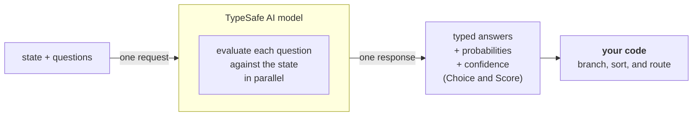

> ## Documentation Index
> Fetch the complete documentation index at: https://docs.typesafe.ai/llms.txt
> Use this file to discover all available pages before exploring further.

# Introduction

> Jev is TypeSafe's flagship model and the first System One model. Send state and typed questions; get structured answers your code can use directly.

Large language models (LLMs) are designed to produce text for humans to read. When you need a model to make a judgment that your code will consume, that creates a mismatch: you are coercing a text-generation system into outputting structured decisions, then parsing the results back into something your code can depend on.

Jev is TypeSafe's flagship model and the first [System One model](/concepts/system-one). System One models are built to make fast, structured decisions that software can use directly. Jev evaluates typed *questions* against a *state* and returns structured results directly. No text generation, no parsing. You get typed values and probability distributions that your code can branch on, sort by, and route with. Choice and Score also return [confidence](/confidence), which your code can use to decide whether and how to act on an answer.



## TypeSafe primitives

TypeSafe exposes three *AI primitives*. Similar to software primitives, our AI primitives are modular, composable, structured, reliable, and fast. Each asks a different type of *question* and returns a different type of answer.

| Question type                | Goal                         | Returns                                 |
| ---------------------------- | ---------------------------- | --------------------------------------- |
| [Choice](/primitives/choice) | Choose an option from a list | `choice`, `probabilities`, `confidence` |
| [Score](/primitives/score)   | Score the state on a rubric  | `score`, `probabilities`, `confidence`  |
| [Noul](/primitives/noul)     | Is this statement true?      | `noul` (0–1)                            |

All three *question* types can be mixed in a single API call. Every *question* is evaluated in parallel and in isolation against the same *state* in one go. Adding questions barely changes the response time. Each question is evaluated independently, so adding more questions does not create context-rot.

## Atomic questions, composed in code

System One models work best when each question asks one specific, well-scoped thing. Think of each question as a gut-check determination: the kind of judgment a highly knowledgeable person could make in a few seconds given the right context.

If the question you want to ask would require extended reasoning or weighs multiple independent factors, decompose it. Ask each factor as a separate question, then combine the results with logic in your code. This keeps each individual evaluation reliable and gives you full control over how dimensions are weighted.

For example, instead of "rate this startup pitch," ask separately about market size, technical feasibility, and differentiation. Combine the scores with your own formula. When priorities shift, change a coefficient in your code rather than rewriting a prompt.

## Next steps

* [Quick Start](/introduction/quickstart) — Everything you need to get started immediately.
* [AI Primer](/introduction/machine-learning-primer) — Why TypeSafe trains models for calibrated decisions instead of generated text.
* [Primitives (Questions)](/primitives) — How to define questions, choose between Choice, Score, and Noul, and ask several at once.
* [Confidence](/confidence) — How TypeSafe reports certainty, and how to use it architecturally.
* [Patterns](/patterns) — Common patterns for building systems with TypeSafe.
> ## Documentation Index
> Fetch the complete documentation index at: https://docs.typesafe.ai/llms.txt
> Use this file to discover all available pages before exploring further.

# Quick start

> Prefer to just dive in? Here's everything you need to get started immediately.

## Try it: the Playground

1. **Open the [Playground](https://console.typesafe.ai/playground)** and log in.
2. **Paste any text** as the state.

```plaintext title="Sample state" theme={null}
Hi, I've been trying to connect my Stripe account for 3 days and the integration keeps failing. I'm losing sales. Please help ASAP.
```

3. **Add a question.** Try a Noul question: `"Does this message express urgency?"`

```json theme={null}
{
  "urgency": {
    "type": "noul",
    "instructions": "Does this message express urgency?"
  }
}
```

4. **Add more questions.** Mix Noul, Choice, and Score in one call and see all results at once.

## Call it: the API

1. **Get your API key** from the [dashboard](https://console.typesafe.ai/keys)
2. **Make a POST request** to the API endpoint
3. **Review the [API Reference](/api)** for all the details.

```http theme={null}
POST https://api.typesafe.ai/v1/systemone
Authorization: Bearer <API_KEY>
Content-Type: application/json
```

### Sample cURL command

```bash theme={null}
curl -X POST https://api.typesafe.ai/v1/systemone \
  -H "Authorization: Bearer $TYPESAFE_API_KEY" \
  -H "Content-Type: application/json" \
  -d @- <<'EOF'
  {
    "state": "Hi, I've been trying to connect my Stripe account for 3 days and the integration keeps failing. I'm losing sales. Please help ASAP.",
    "model": "jev-latest",
    "questions": {
      "urgency": {
        "type": "noul",
        "instructions": "Does this message express urgency?"
      }
    }
  }
EOF
```

### Request body

```json theme={null}
{
  "state": "Hi, I've been trying to connect my Stripe account for 3 days and the integration keeps failing. I'm losing sales. Please help ASAP.",
  "model": "jev-latest",
  "questions": {
    "department": {
      "type": "choice",
      "instructions": "Which team should handle this",
      "criteria": {
        "billing": "Payment or subscription issues",
        "technical": "Bugs or integration problems",
        "sales": "Pricing or account questions"
      }
    },
    "frustration": {
      "type": "score",
      "instructions": "How frustrated the customer appears",
      "criteria": [
        "Calm, just stating facts",
        "Frustrated but civil",
        "Very angry, strong language"
      ]
    },
    "is_urgent": {
      "type": "noul",
      "instructions": "The message conveys urgency or time-sensitivity"
    }
  }
}
```

### Response body

```json theme={null}
{
  "model": "jev-1.13.0",
  "answers": {
    "department": {
      "type": "choice",
      "choice": "technical",
      "confidence": 0.78,
      "probabilities": {
        "technical": 0.85,
        "sales": 0.0,
        "billing": 0.15
      }
    },
    "frustration": {
      "type": "score",
      "score": 1.0,
      "confidence": 1.0,
      "legend": {
        "0": "Calm, just stating facts",
        "1": "Frustrated but civil",
        "2": "Very angry, strong language"
      },
      "probabilities": {
        "0": 0.0,
        "1": 1.0,
        "2": 0.0
      }
    },
    "is_urgent": {
      "type": "noul",
      "noul": 1.0
    }
  },
  "usage": {
    "input_tokens": 392,
    "output_tokens": 65
  }
}
```

See the [API Reference](/api) for all the details.

## Code it: the Python SDK

1. **Install the SDK** (requires Python >= 3.10).

```bash title="With pip" theme={null}
pip install typesafe-sdk
```

```bash title="With uv" theme={null}
uv add typesafe-sdk
```

2. **Use the SDK.** The client reads `TYPESAFE_API_KEY` from the environment and calls `jev-latest` by default.

```python theme={null}
from typesafe_sdk import Choice, Noul, Score, TypeSafeClient

client = TypeSafeClient()

ticket = "Hi, I've been trying to connect my Stripe account for 3 days and the integration keeps failing. I'm losing sales. Please help ASAP."

response = client.system_one(
    state=ticket,
    questions={
        "department": Choice(
            instructions="Which team should handle this",
            criteria={
                "billing": "Payment or subscription issues",
                "technical": "Bugs or integration problems",
                "sales": "Pricing or account questions",
            },
        ),
        "frustration": Score(
            instructions="How frustrated the customer appears",
            criteria=[
                "Calm, just stating facts",
                "Frustrated but civil",
                "Very angry, strong language",
            ],
        ),
        "is_urgent": Noul(
            instructions="The message conveys urgency or time-sensitivity",
        ),
    },
)

print(response.answers["department"].choice)  # "technical"
print(response.answers["frustration"].score)  # 1.0
print(response.answers["is_urgent"].noul)     # 1.0
```

See [client SDKs](/sdk) for installation options and detailed usage.

## Vibe it: the agent skill

1. **[Install the TypeSafe skill](/agent-skill#installation)** using the Claude Code plugin or `npx skills add typesafe-ai/skills --skill typesafe-ai`. You can also [read SKILL.md on GitHub](https://github.com/typesafe-ai/skills/blob/main/skills/typesafe-ai/SKILL.md).

<Tabs>
  <Tab title="Claude Code">
    Run these two commands in your terminal:

    ```bash theme={null}
    claude plugin marketplace add typesafe-ai/skills
    claude plugin install typesafe@typesafe-ai
    ```
  </Tab>

  <Tab title="Other agents">
    ```bash theme={null}
    npx skills add typesafe-ai/skills --skill typesafe-ai
    ```

    Choose your agent when prompted. Installation is project-local by default; add `-g` to install globally.
  </Tab>

  <Tab title="Copy to your agent">
    Paste this prompt into your coding agent:

    ```text wrap theme={null}
    Install the TypeSafe skill. If you're in Claude Code, run `claude plugin marketplace add typesafe-ai/skills`, then `claude plugin install typesafe@typesafe-ai`. If you're in another agent, run `npx skills add typesafe-ai/skills --skill typesafe-ai` and select your agent. Use one installation method. You can read the skill directly at https://github.com/typesafe-ai/skills/blob/main/skills/typesafe-ai/SKILL.md (raw: https://raw.githubusercontent.com/typesafe-ai/skills/main/skills/typesafe-ai/SKILL.md). Then use the TypeSafe skill when working on this project.
    ```
  </Tab>
</Tabs>

2. **Tell your coding agent** to use the TypeSafe skill as you build!

```plaintext title="Coding agent prompt" theme={null}
Let's build a simple CLI that uses the TypeSafe API to evaluate a set of supplied documents on multiple dimensions. Use the TypeSafe skill to understand how to use the TypeSafe API and how to structure the system. Ask me questions about what kinds of documents I want to evaluate and on what dimensions.
```

See the [Agent Skill](/agent-skill) page for more details.
> ## Documentation Index
> Fetch the complete documentation index at: https://docs.typesafe.ai/llms.txt
> Use this file to discover all available pages before exploring further.

# System One

> System One models make fast, structured decisions for software. Jev is TypeSafe's flagship model and the first System One model.

System One models are a class of AI models built to make fast, structured decisions that software can use directly. A System One model evaluates a [state](/concepts/state) and returns typed answers and probabilities.

Jev is TypeSafe's flagship model and the first System One model.

Like an LLM, a System One model understands natural-language input. It returns typed decisions and probabilities rather than generated text.

<Note>
  Jev currently accepts text input only. It evaluates strings, JSON objects, and arrays of text. Images, audio, and video are not supported (yet).
</Note>

## How it differs from an LLM

System One models are trained for calibrated decisions: their probabilities are optimized against outcomes to reflect uncertainty. Calibration is measured across groups of predictions; it does not guarantee that an individual answer is correct.

System One models do not write replies, produce code, or generate explanations of their reasoning. You define the possible answers through [primitives](/primitives):

| Primitive                    | Question                              | Example answer space                          | Example output      |
| ---------------------------- | ------------------------------------- | --------------------------------------------- | ------------------- |
| [Choice](/primitives/choice) | Which team should handle this ticket? | `billing`, `technical`, or `account`          | `choice: "billing"` |
| [Score](/primitives/score)   | How frustrated is this customer?      | 0 = calm, 1 = frustrated, 2 = very frustrated | `score: 1.4`        |
| [Noul](/primitives/noul)     | Does this message request a refund?   | True or false                                 | `noul: 0.95`        |

These are illustrative configurations and values. The primitive pages describe the available configuration options and full response fields.

Read the [AI primer](/introduction/machine-learning-primer) to learn how System One models work and how they are trained.

<Note>
  The System One name comes from the concept Daniel Kahneman popularized in his book *Thinking, Fast and Slow*. System 1 thinking is fast and intuitive. System 2 is slower and more deliberate. Here, the emphasis is on fast, focused judgments.
</Note>

## Fast judgments inside a larger workflow

For a refund request, your application can:

1. Build a state containing the customer's message, the relevant transactions, and the refund policy.
2. Ask independent questions together: whether a refund was requested, whether the evidence indicates a duplicate charge, and whether the policy supports a refund.
3. Combine the answers with deterministic checks in code, then route the case for action or review.

Once you have seen the primitives in action, you can combine them into a larger system. Because System One models return typed, constrained outputs rather than free-form text, your code can inspect and combine its answers into predictable workflows. See [How to build with TypeSafe](/concepts/how-to-build-with-system-one) for the full workflow.

Answers from System One models also include [confidence](/confidence), so you can decide when to act and when to escalate to a person or a reasoning model.

## Call a System One model

Call a System One model through one of our [client SDKs](/sdk) or `POST /v1/systemone` in the [HTTP API](/api). The `model` field selects which model handles the request. The examples in these docs use `jev-latest`, which is also the SDK default. See [Models](/models) for the available models, their prices, and their aliases.

Start with [State](/concepts/state) to prepare the input and [Primitives (Questions)](/primitives) to explore the types of questions you can ask.
> ## Documentation Index
> Fetch the complete documentation index at: https://docs.typesafe.ai/llms.txt
> Use this file to discover all available pages before exploring further.

# State

> What state is, how to structure it, and how to give a System One model the context it needs.

**State** is the content you ask a System One model to evaluate. It could be a support message, a passage of text, or the current state of your application. You pass it in the `state` field of an API request, alongside the questions you want answered.

Each request evaluates one state against one or more questions. All questions see the same state and are evaluated independently. You can mix [Choice](/primitives/choice), [Score](/primitives/score), and [Noul](/primitives/noul) questions in one request.

## State can be a simple string or a structured JSON value

The simplest state is a plain string:

```python theme={null}
state = "My card was charged twice."
```

State can also be a JSON object or array containing related context, examples, and other information that helps the model answer the associated questions. Think of state as the material you would present to a panel of experts before asking them to make a judgment. In Python, pass the corresponding string, dictionary, or list directly to `client.system_one(state=...)`.

| Format | Useful for                                          | Example                                                                 |
| ------ | --------------------------------------------------- | ----------------------------------------------------------------------- |
| String | A message, article, or passage                      | `"My card was charged twice."`                                          |
| Object | Named fields, related records, or application state | `{"message": "My card was charged twice.", "order_id": "A-104"}`        |
| Array  | A sequence of messages or records                   | `["Hi", "My customer number is TS1337.", "My card was charged twice."]` |

Use an object for most requests so each part of the state has a descriptive name and its relationships remain clear. A string is suitable when the use case is simple and requires only one piece of text.

<Note>
  Jev accepts text only. State must be a string, JSON object, or array of text values. Images, audio, and video are not supported (yet). Jev's primary training language is English; other languages, including CJK scripts, are accepted but currently have lower accuracy — see [Models](/models#language-support).
</Note>

```json title="A support conversation as state" theme={null}
{
  "ticket": {
    "subject": "Duplicate charge",
    "messages": [
      {"from": "customer", "text": "I was charged twice for order A-104. Please refund the duplicate."},
      {"from": "support", "text": "We are checking the charges."}
    ]
  },
  "order": {
    "id": "A-104",
    "charges": [
      {"amount_usd": 49, "status": "captured"},
      {"amount_usd": 49, "status": "captured"}
    ]
  },
  "refund_policy": "Duplicate charges are eligible for a refund."
}
```

This object is one state, even though it contains a conversation, an order, and a policy. Put related information together when the decision requires comparing those parts.

## Separate content from questions

The state contains the content and supporting facts. [Questions](/primitives) define the judgments the model should make about that material. For example, keep the refund request and policy in the state, then ask whether the customer requested a refund and whether the policy supports it.

See [Primitives (Questions)](/primitives) for guidance on instructions, criteria, question types, and asking several questions about one state.

See the [API reference](/api) for the request schema and [client SDKs](/sdk) for installation, typed inputs, and response handling.
> ## Documentation Index
> Fetch the complete documentation index at: https://docs.typesafe.ai/llms.txt
> Use this file to discover all available pages before exploring further.

# Primitives (Questions)

> The three TypeSafe question types (Choice, Score, Noul), the typed answers they return, how to choose between them, and how to ask several at once.

export function TypesafeExample({example, display, title}) {
  const keyStrUriSafe = "ABCDEFGHIJKLMNOPQRSTUVWXYZabcdefghijklmnopqrstuvwxyz0123456789+-$";
  function compressToEncodedURIComponent(input) {
    if (input == null) return "";
    return _compress(input, 6, function (a) {
      return keyStrUriSafe.charAt(a);
    });
  }
  function _compress(uncompressed, bitsPerChar, getCharFromInt) {
    if (uncompressed == null) return "";
    var i, value, context_dictionary = {}, context_dictionaryToCreate = {}, context_c = "", context_wc = "", context_w = "", context_enlargeIn = 2, context_dictSize = 3, context_numBits = 2, context_data = [], context_data_val = 0, context_data_position = 0, ii;
    for (ii = 0; ii < uncompressed.length; ii += 1) {
      context_c = uncompressed.charAt(ii);
      if (!Object.prototype.hasOwnProperty.call(context_dictionary, context_c)) {
        context_dictionary[context_c] = context_dictSize++;
        context_dictionaryToCreate[context_c] = true;
      }
      context_wc = context_w + context_c;
      if (Object.prototype.hasOwnProperty.call(context_dictionary, context_wc)) {
        context_w = context_wc;
      } else {
        if (Object.prototype.hasOwnProperty.call(context_dictionaryToCreate, context_w)) {
          if (context_w.charCodeAt(0) < 256) {
            for (i = 0; i < context_numBits; i++) {
              context_data_val = context_data_val << 1;
              if (context_data_position == bitsPerChar - 1) {
                context_data_position = 0;
                context_data.push(getCharFromInt(context_data_val));
                context_data_val = 0;
              } else {
                context_data_position++;
              }
            }
            value = context_w.charCodeAt(0);
            for (i = 0; i < 8; i++) {
              context_data_val = context_data_val << 1 | value & 1;
              if (context_data_position == bitsPerChar - 1) {
                context_data_position = 0;
                context_data.push(getCharFromInt(context_data_val));
                context_data_val = 0;
              } else {
                context_data_position++;
              }
              value = value >> 1;
            }
          } else {
            value = 1;
            for (i = 0; i < context_numBits; i++) {
              context_data_val = context_data_val << 1 | value;
              if (context_data_position == bitsPerChar - 1) {
                context_data_position = 0;
                context_data.push(getCharFromInt(context_data_val));
                context_data_val = 0;
              } else {
                context_data_position++;
              }
              value = 0;
            }
            value = context_w.charCodeAt(0);
            for (i = 0; i < 16; i++) {
              context_data_val = context_data_val << 1 | value & 1;
              if (context_data_position == bitsPerChar - 1) {
                context_data_position = 0;
                context_data.push(getCharFromInt(context_data_val));
                context_data_val = 0;
              } else {
                context_data_position++;
              }
              value = value >> 1;
            }
          }
          context_enlargeIn--;
          if (context_enlargeIn == 0) {
            context_enlargeIn = Math.pow(2, context_numBits);
            context_numBits++;
          }
          delete context_dictionaryToCreate[context_w];
        } else {
          value = context_dictionary[context_w];
          for (i = 0; i < context_numBits; i++) {
            context_data_val = context_data_val << 1 | value & 1;
            if (context_data_position == bitsPerChar - 1) {
              context_data_position = 0;
              context_data.push(getCharFromInt(context_data_val));
              context_data_val = 0;
            } else {
              context_data_position++;
            }
            value = value >> 1;
          }
        }
        context_enlargeIn--;
        if (context_enlargeIn == 0) {
          context_enlargeIn = Math.pow(2, context_numBits);
          context_numBits++;
        }
        context_dictionary[context_wc] = context_dictSize++;
        context_w = String(context_c);
      }
    }
    if (context_w !== "") {
      if (Object.prototype.hasOwnProperty.call(context_dictionaryToCreate, context_w)) {
        if (context_w.charCodeAt(0) < 256) {
          for (i = 0; i < context_numBits; i++) {
            context_data_val = context_data_val << 1;
            if (context_data_position == bitsPerChar - 1) {
              context_data_position = 0;
              context_data.push(getCharFromInt(context_data_val));
              context_data_val = 0;
            } else {
              context_data_position++;
            }
          }
          value = context_w.charCodeAt(0);
          for (i = 0; i < 8; i++) {
            context_data_val = context_data_val << 1 | value & 1;
            if (context_data_position == bitsPerChar - 1) {
              context_data_position = 0;
              context_data.push(getCharFromInt(context_data_val));
              context_data_val = 0;
            } else {
              context_data_position++;
            }
            value = value >> 1;
          }
        } else {
          value = 1;
          for (i = 0; i < context_numBits; i++) {
            context_data_val = context_data_val << 1 | value;
            if (context_data_position == bitsPerChar - 1) {
              context_data_position = 0;
              context_data.push(getCharFromInt(context_data_val));
              context_data_val = 0;
            } else {
              context_data_position++;
            }
            value = 0;
          }
          value = context_w.charCodeAt(0);
          for (i = 0; i < 16; i++) {
            context_data_val = context_data_val << 1 | value & 1;
            if (context_data_position == bitsPerChar - 1) {
              context_data_position = 0;
              context_data.push(getCharFromInt(context_data_val));
              context_data_val = 0;
            } else {
              context_data_position++;
            }
            value = value >> 1;
          }
        }
        context_enlargeIn--;
        if (context_enlargeIn == 0) {
          context_enlargeIn = Math.pow(2, context_numBits);
          context_numBits++;
        }
        delete context_dictionaryToCreate[context_w];
      } else {
        value = context_dictionary[context_w];
        for (i = 0; i < context_numBits; i++) {
          context_data_val = context_data_val << 1 | value & 1;
          if (context_data_position == bitsPerChar - 1) {
            context_data_position = 0;
            context_data.push(getCharFromInt(context_data_val));
            context_data_val = 0;
          } else {
            context_data_position++;
          }
          value = value >> 1;
        }
      }
      context_enlargeIn--;
      if (context_enlargeIn == 0) {
        context_enlargeIn = Math.pow(2, context_numBits);
        context_numBits++;
      }
    }
    value = 2;
    for (i = 0; i < context_numBits; i++) {
      context_data_val = context_data_val << 1 | value & 1;
      if (context_data_position == bitsPerChar - 1) {
        context_data_position = 0;
        context_data.push(getCharFromInt(context_data_val));
        context_data_val = 0;
      } else {
        context_data_position++;
      }
      value = value >> 1;
    }
    while (true) {
      context_data_val = context_data_val << 1;
      if (context_data_position == bitsPerChar - 1) {
        context_data.push(getCharFromInt(context_data_val));
        break;
      } else context_data_position++;
    }
    return context_data.join("");
  }
  function buildHref(ex) {
    const documentText = ex.state === undefined ? "" : typeof ex.state === "string" ? ex.state : JSON.stringify(ex.state, null, 2);
    return "https://console.typesafe.ai/decode#share/" + compressToEncodedURIComponent(JSON.stringify({
      apiVersion: "v1",
      documentText,
      promptsText: JSON.stringify(ex.questions, null, 2),
      selectedModels: ex.selectedModels
    }));
  }
  const displayedExample = display === "questions" ? example.questions : example.state === undefined ? {
    questions: example.questions
  } : {
    state: example.state,
    questions: example.questions
  };
  const code = JSON.stringify(displayedExample, null, 2);
  const href = buildHref(example);
  return <div style={{
    margin: "1.25rem 0"
  }}>
      <CodeBlock language="json" filename={title ?? "request"}>
        {code}
      </CodeBlock>
      <div className="pb-8">
        <a href={href} target="_blank" rel="noreferrer" className="text-primary">
          Try it in the Playground →
        </a>
      </div>
    </div>;
}

TypeSafe's primitives are the small, typed building blocks you compose in code. They come in pairs: a question defines one judgment for a [System One model](/concepts/system-one) to make about a [state](/concepts/state), and its answer is the typed value that comes back. You compose the answers in your code to make decisions. There are three question types, each returning a different shape of answer.

| Type                         | What it answers         | Returns                                          |
| ---------------------------- | ----------------------- | ------------------------------------------------ |
| [Choice](/primitives/choice) | Which of these options? | `choice`, `probabilities`, `confidence`          |
| [Score](/primitives/score)   | Which level?            | `score`, `legend`, `probabilities`, `confidence` |
| [Noul](/primitives/noul)     | Is this true?           | `noul` (0 to 1)                                  |

You can ask one question or send several together. Every question in a request sees the same state, is evaluated independently, and returns a typed answer under the ID you chose.

## Ask for one snap judgment per question

System One models are built for fast, focused judgments. Ask for a judgment a knowledgeable person makes in a second given the right context. "Does this message convey urgency?" is a good question. "Analyze this message and determine the best course of action" is not. That needs slow reasoning, and it is a signal to break the task into small questions and compose the answers in code.

If the judgment you want depends on several independent factors, ask about each factor separately and combine the answers with your own logic. Instead of "rate this startup pitch", ask about market size, technical feasibility, and differentiation, then weight them in code based on their relative importance. When priorities shift, change the value of weights rather than rewriting a prompt. [Ask multiple questions together](#ask-multiple-questions-together) shows how to do this.

## Define a question

Every question has an ID, a `type`, and `instructions`. Choice and Score questions also take `criteria`, which define the options for a Choice question or the levels for a Score. Noul questions accept `criteria` as an optional clarification of what yes and no mean.

* ID. The key you pick, such as `refund_requested`. It identifies the answer in the response.
* `type`. One of `choice`, `score`, or `noul`.
* `instructions`. The question you are asking about the state. This is where your evaluation logic goes. Write it as a clear, specific question, or as a statement for the model to judge. A string is enough for most questions. It can also be an object or an array, which puts the question in one field and the data it refers to in others; see [Use structure in the questions](/concepts/how-to-build-with-system-one#use-structure-in-the-questions).
* `criteria`. The possible answers: a map of options for a Choice question, an ordered list of levels for a Score, and an optional description of yes and no for a Noul. Each question type's page covers its shape.

This question asks whether a customer requested a refund:

```python theme={null}
from typesafe_sdk import Noul

questions = {
    "refund_requested": Noul(
        instructions="Does the customer request a refund?",
    ),
}
```

<Tip>
  Question IDs are for your code. They are not sent to the model. Write the complete question in `instructions`, even when the ID seems self-explanatory.
</Tip>

## Choose a question type

Pick the type that matches the shape of the answer you need.

* **Choice** fits when the answer is one of a known set of options with no order between them: routing a ticket to a department, classifying a document type, detecting a programming language. Give the full list of options, and add an `other` or `none of the above` option when the list might not cover every input.

* **Score** fits when the answer falls on a spectrum and you can describe what each point on that spectrum means: bug severity, customer frustration, skill level. The levels are yours to define, and the model returns a position along them.

* **Noul** fits a clean yes/no question where the probability itself is the useful signal: does this message contain personally identifiable information, is the customer requesting a refund, does the resume mention distributed systems.

<Note>
  Use Noul for a yes/no judgment and Score to measure a position on a spectrum. "Is this candidate strong in Python?" needs a clear definition of "strong". A Noul value of 0.5 means the model gives yes and no equal probability. It does not mean the candidate has a medium skill level. An unclear definition makes that probability hard to interpret.

  If you want to measure skill level, use a Score with defined levels, such as no experience, some familiarity, daily use, and deep expertise. If you need a yes/no decision, define the condition clearly, such as "Does the resume state that the candidate has used Python at work?"
</Note>

If two types both seem to fit, prefer the one whose answer your code can act on directly. A Choice between `refund`, `rebook`, and `information` maps straight onto three code paths. A Score of customer frustration maps onto a threshold. A Noul maps onto an `if`.

## What comes back

Answers are primitives too. Each question type returns a typed value that your code can compare, threshold, sort, pass into further logic, or put into the state of a follow-up request (see [When one question depends on another](#when-one-question-depends-on-another)).

| Type   | Answer fields                                    | How to read it                                                                                                                                                       |
| ------ | ------------------------------------------------ | -------------------------------------------------------------------------------------------------------------------------------------------------------------------- |
| Choice | `choice`, `probabilities`, `confidence`          | `choice` is the selected option. `probabilities` is the distribution across every option. `confidence` summarizes how peaked that distribution is.                   |
| Score  | `score`, `legend`, `probabilities`, `confidence` | `score` is a position along your levels, and can fall between two of them. `legend` repeats the levels by number. `probabilities` is the distribution across levels. |
| Noul   | `noul`                                           | The probability that the answer is yes. Near 1 is a strong yes, near 0 a strong no, near 0.5 uncertain. Noul has no separate `confidence`.                           |

Two properties of these answers make them composable:

* **Every answer is constrained to the options you supplied.** The model returns a probability distribution over your options or levels, never a value outside them. Your code never has to recover a value from generated prose.
* **Every answer is independent.** One question's answer is not hidden context for another. You can add or remove questions without changing the others' results.

[Confidence](/confidence) explains how `confidence` is derived from `probabilities` and how to use it to decide when to act automatically and when to escalate to a person.

## Reference specific fields

The content being evaluated, the [state](/concepts/state), is often a JSON object with several parts: a conversation, a record, a policy. When a question is about one of those parts, name it in the `instructions` with a dot-and-index path to its key, including the backticks. The model then knows which part of the state to judge.

Take the support conversation from the State page:

```json theme={null}
{
  "ticket": {
    "subject": "Duplicate charge",
    "messages": [
      {"from": "customer", "text": "I was charged twice for order A-104. Please refund the duplicate."},
      {"from": "support", "text": "We are checking the charges."}
    ]
  },
  "order": {
    "id": "A-104",
    "charges": [
      {"amount_usd": 49, "status": "captured"},
      {"amount_usd": 49, "status": "captured"}
    ]
  },
  "refund_policy": "Duplicate charges are eligible for a refund."
}
```

These two questions point at the customer's message, the policy, and the charges by path:

```python theme={null}
questions = {
    "refund_requested": {
        "type": "noul",
        "instructions": "Does `ticket.messages[0].text` request a refund?",
    },
    "policy_supports_refund": {
        "type": "noul",
        "instructions": (
            "Does `refund_policy` support the refund requested "
            "in `ticket.messages[0].text`, given `order.charges`?"
        ),
    },
}
```

Explicit paths make it clear which parts of a structured state should inform each judgment. See [State](/concepts/state) for how to structure the input.

## Ask multiple questions together

Send every question that uses the same state in one request. You can mix question types freely. System One models evaluate every question in a request in parallel. Adding questions barely changes the response time and costs only the tokens for the extra questions, which are cheap. Asking a question you might not need is close to free.

This request classifies a customer message, checks for urgency, and scores frustration all at once:

<TypesafeExample
  example={{
state:
  "Our API integration started returning 500 errors on every request about 20 minutes ago, and we can't process any customer orders until this is fixed.",
questions: {
  department: {
    type: 'choice',
    instructions: 'Which team should handle this',
    criteria: {
      billing: 'Payment or subscription issues',
      technical: 'Bugs or integration problems',
      sales: 'Pricing or account questions',
    },
  },
  is_urgent: {
    type: 'noul',
    instructions: 'The message conveys urgency or time-sensitivity',
  },
  frustration: {
    type: 'score',
    instructions: 'How frustrated the customer appears',
    criteria: [
      'Calm, just stating facts',
      'Frustrated but civil',
      'Very angry, strong language',
    ],
  },
},
}}
/>

Our [client SDKs](/sdk) provide typed questions and answers. In Python, pass a `questions` dictionary of `Choice`, `Noul`, and `Score` objects to `client.system_one(...)`. This request sends a ticket and a refund policy once and gets a typed answer for each question:

```python theme={null}
from typesafe_sdk import Choice, Noul, Score, TypeSafeClient

state = {
    "ticket_message": "My flight was cancelled. Can I get a refund?",
    "refund_policy": "Cancelled flights are eligible for a full refund.",
}

with TypeSafeClient() as client:
    response = client.system_one(
        state=state,
        questions={
            "refund_requested": Noul(
                instructions="Does `ticket_message` request a refund?",
            ),
            "request_type": Choice(
                instructions="What is the main request in `ticket_message`?",
                criteria={
                    "refund": "The customer wants money returned.",
                    "rebooking": "The customer wants a replacement flight.",
                    "information": "The customer is asking for information only.",
                },
            ),
            "frustration": Score(
                instructions="How frustrated does the customer appear in `ticket_message`?",
                criteria=[
                    "Calm and neutral.",
                    "Concerned but civil.",
                    "Very angry or using strong language.",
                ],
            ),
        },
    )

print(response.answers["refund_requested"].noul)
print(response.answers["request_type"].choice)
print(response.answers["frustration"].score)
```

See [client SDKs](/sdk) for installation and usage in your language.

### Ask speculative questions

Ask every question your code might need, including ones whose answer only matters for some inputs, and let the code decide which answers to use. If a ticket turns out not to be a bug report, ignore the severity answer. We call this the [Speculative fan-out](/patterns/fan-out) pattern. The [Parallel questions cookbook](/cookbooks/parallel_questions) shows how batching 13 questions into one call is 11.5x cheaper and 9.6x faster than 13 separate calls, with no change in the answers.

<Tip>
  Coding agents fall into the one question per call habit more than people do. The [TypeSafe agent skill](/agent-skill#installation) tells your agent to put many questions in each call, including ones that only matter for some inputs.
</Tip>

### Split a complex judgment into several questions

A judgment that depends on several things is best split into one question per thing. Combine the answers in your code, giving each a weight for its relative importance. The weights are yours. When the combined result doesn't match what your team would decide, change them in code and run again. Adding questions barely changes the response time because they run in parallel within one request. The split costs a few extra question tokens.

For example, ticket priority might be built from three Score questions: how severe the bug is, how frustrated the customer is, and how much the report gives an engineer to work with. The Score page walks through this request and the code that normalizes and weights the answers in [Splitting a complex judgment into several Scores](/primitives/score#splitting-a-complex-judgment-into-several-scores). This technique is called the [Composite scoring](/patterns/composite-scoring) pattern.

### When one question depends on another

Questions in the same request are independent: one answer does not become context for another question. If a later judgment depends on an earlier answer, make a second request in code. The dependency is real only when your code cannot build the second request until it has the first answer: it needs the answer to fetch more data for the state, to decide what the state is made of, or to pick the next question's options. Otherwise, ask the questions together and combine their answers in code.

Two requests are the exception, not the rule. If the second request's questions could have been asked against the original state, ask them in the first request and let the code ignore the ones it doesn't need. Three cookbooks make a second request for a real reason. [Skill suggestion](/cookbooks/skill_suggestion) ranks 182 skills in one request, then fetches the full text of the top three and judges them again against that better evidence. [Structure recovery](/cookbooks/autoformat) asks whether each line break split a sentence, merges lines into blocks from those answers, then classifies the blocks, which did not exist until the first request had answered. [Hierarchical classification](/cookbooks/hierarchical_classification) uses each Choice answer to decide which options the next request offers.

See [How to build with TypeSafe](/concepts/how-to-build-with-system-one) for guidance on breaking a workflow into focused judgments.

## Next steps

<Columns cols={3}>
  <Card title="Choice" href="/primitives/choice" icon="list">
    Pick one option from a fixed list.
  </Card>

  <Card title="Score" href="/primitives/score" icon="gauge">
    Rate the state along ordered levels.
  </Card>

  <Card title="Noul" href="/primitives/noul" icon="circle-check">
    Get the probability that a statement is true.
  </Card>
</Columns>

To see how these compose into system architectures, head to [Patterns](/patterns).
> ## Documentation Index
> Fetch the complete documentation index at: https://docs.typesafe.ai/llms.txt
> Use this file to discover all available pages before exploring further.

# Choice

> A Choice is a System One question type for selecting one option from a defined set. The answer includes the selected option, a probability for each option, and confidence.

export function TypesafeExample({example, display, title}) {
  const keyStrUriSafe = "ABCDEFGHIJKLMNOPQRSTUVWXYZabcdefghijklmnopqrstuvwxyz0123456789+-$";
  function compressToEncodedURIComponent(input) {
    if (input == null) return "";
    return _compress(input, 6, function (a) {
      return keyStrUriSafe.charAt(a);
    });
  }
  function _compress(uncompressed, bitsPerChar, getCharFromInt) {
    if (uncompressed == null) return "";
    var i, value, context_dictionary = {}, context_dictionaryToCreate = {}, context_c = "", context_wc = "", context_w = "", context_enlargeIn = 2, context_dictSize = 3, context_numBits = 2, context_data = [], context_data_val = 0, context_data_position = 0, ii;
    for (ii = 0; ii < uncompressed.length; ii += 1) {
      context_c = uncompressed.charAt(ii);
      if (!Object.prototype.hasOwnProperty.call(context_dictionary, context_c)) {
        context_dictionary[context_c] = context_dictSize++;
        context_dictionaryToCreate[context_c] = true;
      }
      context_wc = context_w + context_c;
      if (Object.prototype.hasOwnProperty.call(context_dictionary, context_wc)) {
        context_w = context_wc;
      } else {
        if (Object.prototype.hasOwnProperty.call(context_dictionaryToCreate, context_w)) {
          if (context_w.charCodeAt(0) < 256) {
            for (i = 0; i < context_numBits; i++) {
              context_data_val = context_data_val << 1;
              if (context_data_position == bitsPerChar - 1) {
                context_data_position = 0;
                context_data.push(getCharFromInt(context_data_val));
                context_data_val = 0;
              } else {
                context_data_position++;
              }
            }
            value = context_w.charCodeAt(0);
            for (i = 0; i < 8; i++) {
              context_data_val = context_data_val << 1 | value & 1;
              if (context_data_position == bitsPerChar - 1) {
                context_data_position = 0;
                context_data.push(getCharFromInt(context_data_val));
                context_data_val = 0;
              } else {
                context_data_position++;
              }
              value = value >> 1;
            }
          } else {
            value = 1;
            for (i = 0; i < context_numBits; i++) {
              context_data_val = context_data_val << 1 | value;
              if (context_data_position == bitsPerChar - 1) {
                context_data_position = 0;
                context_data.push(getCharFromInt(context_data_val));
                context_data_val = 0;
              } else {
                context_data_position++;
              }
              value = 0;
            }
            value = context_w.charCodeAt(0);
            for (i = 0; i < 16; i++) {
              context_data_val = context_data_val << 1 | value & 1;
              if (context_data_position == bitsPerChar - 1) {
                context_data_position = 0;
                context_data.push(getCharFromInt(context_data_val));
                context_data_val = 0;
              } else {
                context_data_position++;
              }
              value = value >> 1;
            }
          }
          context_enlargeIn--;
          if (context_enlargeIn == 0) {
            context_enlargeIn = Math.pow(2, context_numBits);
            context_numBits++;
          }
          delete context_dictionaryToCreate[context_w];
        } else {
          value = context_dictionary[context_w];
          for (i = 0; i < context_numBits; i++) {
            context_data_val = context_data_val << 1 | value & 1;
            if (context_data_position == bitsPerChar - 1) {
              context_data_position = 0;
              context_data.push(getCharFromInt(context_data_val));
              context_data_val = 0;
            } else {
              context_data_position++;
            }
            value = value >> 1;
          }
        }
        context_enlargeIn--;
        if (context_enlargeIn == 0) {
          context_enlargeIn = Math.pow(2, context_numBits);
          context_numBits++;
        }
        context_dictionary[context_wc] = context_dictSize++;
        context_w = String(context_c);
      }
    }
    if (context_w !== "") {
      if (Object.prototype.hasOwnProperty.call(context_dictionaryToCreate, context_w)) {
        if (context_w.charCodeAt(0) < 256) {
          for (i = 0; i < context_numBits; i++) {
            context_data_val = context_data_val << 1;
            if (context_data_position == bitsPerChar - 1) {
              context_data_position = 0;
              context_data.push(getCharFromInt(context_data_val));
              context_data_val = 0;
            } else {
              context_data_position++;
            }
          }
          value = context_w.charCodeAt(0);
          for (i = 0; i < 8; i++) {
            context_data_val = context_data_val << 1 | value & 1;
            if (context_data_position == bitsPerChar - 1) {
              context_data_position = 0;
              context_data.push(getCharFromInt(context_data_val));
              context_data_val = 0;
            } else {
              context_data_position++;
            }
            value = value >> 1;
          }
        } else {
          value = 1;
          for (i = 0; i < context_numBits; i++) {
            context_data_val = context_data_val << 1 | value;
            if (context_data_position == bitsPerChar - 1) {
              context_data_position = 0;
              context_data.push(getCharFromInt(context_data_val));
              context_data_val = 0;
            } else {
              context_data_position++;
            }
            value = 0;
          }
          value = context_w.charCodeAt(0);
          for (i = 0; i < 16; i++) {
            context_data_val = context_data_val << 1 | value & 1;
            if (context_data_position == bitsPerChar - 1) {
              context_data_position = 0;
              context_data.push(getCharFromInt(context_data_val));
              context_data_val = 0;
            } else {
              context_data_position++;
            }
            value = value >> 1;
          }
        }
        context_enlargeIn--;
        if (context_enlargeIn == 0) {
          context_enlargeIn = Math.pow(2, context_numBits);
          context_numBits++;
        }
        delete context_dictionaryToCreate[context_w];
      } else {
        value = context_dictionary[context_w];
        for (i = 0; i < context_numBits; i++) {
          context_data_val = context_data_val << 1 | value & 1;
          if (context_data_position == bitsPerChar - 1) {
            context_data_position = 0;
            context_data.push(getCharFromInt(context_data_val));
            context_data_val = 0;
          } else {
            context_data_position++;
          }
          value = value >> 1;
        }
      }
      context_enlargeIn--;
      if (context_enlargeIn == 0) {
        context_enlargeIn = Math.pow(2, context_numBits);
        context_numBits++;
      }
    }
    value = 2;
    for (i = 0; i < context_numBits; i++) {
      context_data_val = context_data_val << 1 | value & 1;
      if (context_data_position == bitsPerChar - 1) {
        context_data_position = 0;
        context_data.push(getCharFromInt(context_data_val));
        context_data_val = 0;
      } else {
        context_data_position++;
      }
      value = value >> 1;
    }
    while (true) {
      context_data_val = context_data_val << 1;
      if (context_data_position == bitsPerChar - 1) {
        context_data.push(getCharFromInt(context_data_val));
        break;
      } else context_data_position++;
    }
    return context_data.join("");
  }
  function buildHref(ex) {
    const documentText = ex.state === undefined ? "" : typeof ex.state === "string" ? ex.state : JSON.stringify(ex.state, null, 2);
    return "https://console.typesafe.ai/decode#share/" + compressToEncodedURIComponent(JSON.stringify({
      apiVersion: "v1",
      documentText,
      promptsText: JSON.stringify(ex.questions, null, 2),
      selectedModels: ex.selectedModels
    }));
  }
  const displayedExample = display === "questions" ? example.questions : example.state === undefined ? {
    questions: example.questions
  } : {
    state: example.state,
    questions: example.questions
  };
  const code = JSON.stringify(displayedExample, null, 2);
  const href = buildHref(example);
  return <div style={{
    margin: "1.25rem 0"
  }}>
      <CodeBlock language="json" filename={title ?? "request"}>
        {code}
      </CodeBlock>
      <div className="pb-8">
        <a href={href} target="_blank" rel="noreferrer" className="text-primary">
          Try it in the Playground →
        </a>
      </div>
    </div>;
}

Use a Choice when the answer is one of a fixed set of options. For example, which team handles a ticket, which category a product belongs to, or which language a code snippet is written in. If the answer is a position on a spectrum, use a [Score](/primitives/score). If it's a yes or no, use a [Noul](/primitives/noul). [Choose a question type](/primitives#choose-a-question-type) compares all three.

A Choice answer is the selected option in `choice`. The model also returns a probability for every option in `probabilities`, and a `confidence` value for the selected option.

Example questions:

```
"What programming language is this code written in"
  → options: python, javascript, typescript, go, rust, other

"What type of meeting is this based on the title and description"
  → options: standup, planning, retrospective, one on one, brainstorm, none of the above

"Which product category does this item belong to"
  → options: electronics, clothing, home garden, food and beverage
```

## Request structure

The POST request body to the [TypeSafe API](/api) has a specific structure. The top level has three fields: `state`, the content to evaluate; `model`; and `questions`, a map from question ids you choose to question objects. Each Choice question has the following fields:

* `type`: Always `"choice"`.
* `instructions`: The question the model answers.
* `criteria`: The answer options, as a map. Each key is an option name and each value is a description of that option.

Below is a request where the state is a support ticket from an online shoe store and the question is which team should handle it:

<TypesafeExample
  display="request"
  example={{
state: 'My running shoes arrived in the wrong size. Can I swap them for a size 10?',
selectedModels: ['jev-latest'],
questions: {
  department: {
    type: 'choice',
    instructions: 'Which team should handle this?',
    criteria: {
      returns: 'Exchanges, wrong or damaged items',
      shipping: 'Delivery status, delays, lost packages',
      billing: 'Charges, invoices, payment problems',
    },
  },
},
}}
/>

You choose the question id, `department` in this case. The answer is returned under the same id. The model never sees the question id. The option names and their descriptions are both sent to the model, so write descriptions that separate the options from each other.

Our [client SDKs](/sdk) provide typed questions. In Python, the same question is a `Choice`:

```python theme={null}
from typesafe_sdk import Choice, TypeSafeClient

with TypeSafeClient() as client:
    response = client.system_one(
        state="My running shoes arrived in the wrong size. Can I swap them for a size 10?",
        questions={
            "department": Choice(
                instructions="Which team should handle this?",
                criteria={
                    "returns": "Exchanges, wrong or damaged items",
                    "shipping": "Delivery status, delays, lost packages",
                    "billing": "Charges, invoices, payment problems",
                },
            ),
        },
    )

    print(response.answers["department"].choice)
```

Use the `system_one` method or the `https://api.typesafe.ai/v1/systemone` endpoint to call a System One model. The `model` field selects which model handles the request. [How to build with TypeSafe](/concepts/how-to-build-with-system-one) covers where in your code to call it.

Use one of our [client SDKs](/sdk) or call the [HTTP API](/api) directly. If a coding agent is writing the integration for you, install the [TypeSafe agent skill](/agent-skill#installation) first so it knows the request and response shapes.

<Note>
  `instructions` and each entry in `criteria` can be a string, an object, or an array. Start with a string. Use an object when a description needs several kinds of guidance, such as what an option covers, what it doesn't cover, and some examples. See [Structured instructions and criteria](#structured-instructions-and-criteria) below and the [API reference](/api#param-instructions-1).
</Note>

## Response structure

The response has one entry in `answers` per question, under the ids from the request. This is the response to the example request above:

```json theme={null}
{
  "model": "jev-1.13.0",
  "answers": {
    "department": {
      "type": "choice",
      "choice": "returns",
      "confidence": 1.0,
      "probabilities": {
        "shipping": 0.0,
        "returns": 1.0,
        "billing": 0.0
      }
    }
  },
  "usage": {
    "input_tokens": 328,
    "output_tokens": 34
  }
}
```

Besides `type`, each Choice answer has three values:

* `choice`: The option with the highest probability.
* `probabilities`: The full probability distribution across every option. The sum of all values is 1.
* [`confidence`](/confidence): A number from 0 to 1 computed from how `probabilities` is spread. A flat shape, with probability spread across several options, means low confidence. A single peak on one option means high confidence.

This ticket is an easy one, so all of the probability is on `returns` and confidence is 1.0. A ticket that mentions a wrong size and a missing refund would split probability between `returns` and `billing`, and confidence would drop.

## Good practice: ask more than one question per call

Ask every Choice question your code might need in a single request rather than one request per question. Questions are evaluated in parallel. Adding questions barely changes the response time, and the code can ignore answers it doesn't need. Extra questions still cost tokens. [Ask multiple questions together](/primitives#ask-multiple-questions-together) explains this in full; the next section shows five Choice questions in one call.

The same logic applies to the options inside a single Choice question. A Choice question accepts up to 255 options, and adding options costs a few tokens each, so give the model the full list of teams, categories, or products rather than a shortlist. Add an `other` or `none of the above` option when the list might not cover every input, so the model can say none of the others fit.

To classify documents through a deep hierarchy or large taxonomy, chain Choice questions level by level. The [Hierarchical Classification cookbook](/cookbooks/hierarchical_classification) shows how to run a beam search over Choice probabilities, keeping the best `K` candidate paths at each level instead of committing to a single greedy path.

## A more complex example

The basic example above routes a ticket to a team. A bigger support system might also need the return reason, the delivery problem, what the customer wants, and the customer's tone.

The request below asks five Choice questions about a ticket that is more ambiguous than the first: it involves three teams and doesn't say what the customer wants.

<TypesafeExample
  display="request"
  example={{
state: 'Shoes arrived two weeks late and in the wrong size. Also I see two charges of $120 on my card. What are you going to do about this?',
selectedModels: ['jev-latest'],
questions: {
  department: {
    type: 'choice',
    instructions: 'Which team should handle this?',
    criteria: {
      returns: 'Exchanges, wrong or damaged items',
      shipping: 'Delivery status, delays, lost packages',
      billing: 'Charges, invoices, payment problems',
    },
  },
  return_reason: {
    type: 'choice',
    instructions: 'If the customer wants to return something, why?',
    criteria: {
      wrong_size: "The item doesn't fit",
      wrong_item: 'A different product was delivered',
      damaged: 'The item arrived broken or faulty',
      changed_mind: 'The item is fine, the customer no longer wants it',
      other: 'A return reason that fits none of the above',
    },
  },
  shipping_issue: {
    type: 'choice',
    instructions: 'If this is a shipping problem, which kind is it?',
    criteria: {
      not_delivered: 'The package never arrived',
      delayed: 'The package is late but still on its way',
      wrong_address: 'The package went to the wrong place',
      damaged_in_transit: 'The package arrived damaged',
      other: 'A shipping problem that fits none of the above',
    },
  },
  requested_resolution: {
    type: 'choice',
    instructions: 'What does the customer want to happen?',
    criteria: {
      exchange: 'Swap the item for a different one',
      refund: 'Money back',
      replacement: 'The same item sent again',
      information: 'Just an answer, no action needed',
    },
  },
  tone: {
    type: 'choice',
    instructions: "What is the customer's tone?",
    criteria: {
      calm: null,
      frustrated: null,
      angry: null,
    },
  },
},
}}
/>

Two of these Choice questions are speculative: `return_reason` only matters if the `department` is `returns`, and `shipping_issue` only matters if it's `shipping`. The `tone` question uses `null` descriptions because the option names are clear on their own.

The TypeSafe response:

```json theme={null}
{
  "model": "jev-1.13.0",
  "answers": {
    "department": {
      "type": "choice",
      "choice": "returns",
      "confidence": 0.42,
      "probabilities": {
        "shipping": 0.04,
        "billing": 0.35,
        "returns": 0.61
      }
    },
    "return_reason": {
      "type": "choice",
      "choice": "wrong_size",
      "confidence": 1.0,
      "probabilities": {
        "other": 0.0,
        "wrong_size": 1.0,
        "changed_mind": 0.0,
        "damaged": 0.0,
        "wrong_item": 0.0
      }
    },
    "shipping_issue": {
      "type": "choice",
      "choice": "delayed",
      "confidence": 0.67,
      "probabilities": {
        "wrong_address": 0.0,
        "other": 0.26,
        "not_delivered": 0.0,
        "damaged_in_transit": 0.0,
        "delayed": 0.74
      }
    },
    "requested_resolution": {
      "type": "choice",
      "choice": "refund",
      "confidence": 0.2,
      "probabilities": {
        "replacement": 0.34,
        "refund": 0.4,
        "information": 0.02,
        "exchange": 0.24
      }
    },
    "tone": {
      "type": "choice",
      "choice": "frustrated",
      "confidence": 0.76,
      "probabilities": {
        "frustrated": 0.84,
        "angry": 0.16,
        "calm": 0.0
      }
    }
  },
  "usage": {
    "input_tokens": 589,
    "output_tokens": 212
  }
}
```

Each question is answered on its own against the ticket:

* The `department` answer is `returns` with a 0.61 probability, but `billing` has 0.35 because of the double charge. The ticket belongs to two teams, and the split confidence of 0.42 reflects that.
* The `return_reason` is `wrong_size` with a confidence of 1.0, which is expected because it says this clearly in the ticket.
* The `shipping_issue` answer is split between `delayed` and `other`. It's a speculative question and `department` didn't come back as shipping, so it can be ignored by the code, as shown in the example code snippet below.
* The `requested_resolution` answer leans to `refund` at 0.40, with `replacement` and `exchange` sharing most of the rest, and the confidence is 0.20. The double charge suggests money back, the wrong size suggests a swap, and the customer never says which they want.
* The `tone` answer is `frustrated` with a probability of 0.84 and a confidence of 0.76.

The example code below reads the answers it needs, ignores the rest, and treats a low-confidence answer as a reason to ask rather than act:

```python theme={null}
from typesafe_sdk import Choice, TypeSafeClient

TRIAGE_QUESTIONS = {
    "department": Choice(
        instructions="Which team should handle this?",
        criteria={
            "returns": "Exchanges, wrong or damaged items",
            "shipping": "Delivery status, delays, lost packages",
            "billing": "Charges, invoices, payment problems",
        },
    ),
    "return_reason": Choice(
        instructions="If the customer wants to return something, why?",
        criteria={
            "wrong_size": "The item doesn't fit",
            "wrong_item": "A different product was delivered",
            "damaged": "The item arrived broken or faulty",
            "changed_mind": "The item is fine, the customer no longer wants it",
            "other": "A return reason that fits none of the above",
        },
    ),
    "shipping_issue": Choice(
        instructions="If this is a shipping problem, which kind is it?",
        criteria={
            "not_delivered": "The package never arrived",
            "delayed": "The package is late but still on its way",
            "wrong_address": "The package went to the wrong place",
            "damaged_in_transit": "The package arrived damaged",
            "other": "A shipping problem that fits none of the above",
        },
    ),
    "requested_resolution": Choice(
        instructions="What does the customer want to happen?",
        criteria={
            "exchange": "Swap the item for a different one",
            "refund": "Money back",
            "replacement": "The same item sent again",
            "information": "Just an answer, no action needed",
        },
    ),
    "tone": Choice(
        instructions="What is the customer's tone?",
        criteria={"calm": None, "frustrated": None, "angry": None},
    ),
}


def triage(ticket: str) -> None:
    with TypeSafeClient() as client:
        response = client.system_one(
            state=ticket,
            questions=TRIAGE_QUESTIONS,
        )
    answers = response.answers

    department = answers["department"]
    if department.confidence < 0.3:
        # Not clear which team to send to. Let a person decide.
        send_to_manual_triage(ticket)
        return

    if department.choice == "returns":
        # return_reason answer is only used here
        assign(ticket, team="returns", issue=answers["return_reason"].choice)
    elif department.choice == "shipping":
        # shipping_issue answer is only used here
        assign(ticket, team="shipping", issue=answers["shipping_issue"].choice)
    else:
        assign(ticket, team="billing")

    # A second team with a real share of the probability gets a copy
    for team, probability in department.probabilities.items():
        if team != department.choice and probability > 0.25:
            notify(ticket, team=team)

    resolution = answers["requested_resolution"]
    if resolution.confidence < 0.5:
        # The customer hasn't said what they want. Ask, don't guess.
        ask_customer_what_they_want(ticket)
    elif resolution.choice == "refund":
        flag_for_refund_approval(ticket)

    if answers["tone"].choice == "angry":
        flag_for_senior_agent(ticket)
```

For the ticket above, this assigns the ticket to the returns team with issue `wrong_size`, sends the billing team a copy because its 0.35 share is over the 0.25 threshold, and asks the customer what they want because the resolution confidence of 0.20 is under 0.5. The code does not use the `shipping_issue` answer.

One request, five answers, and the routing logic is ordinary `if` statements. If you later need to know the customer's language, or which product the ticket is about, add another Choice question to `TRIAGE_QUESTIONS`; the request count stays at one.

The [smart home assistant demo](/demos/smart-home) evaluates every user request against a long list of Choice questions in one call: the request category, the room, the device, and the action. Most of those questions are irrelevant to any one request and the code ignores them.

## Structured instructions and criteria

Start with a one-line description per option. When two options are similar and the model keeps confusing them, describe each one with an object instead of a string. Give it fields for what the option covers, what belongs to a neighboring option instead, and a few example inputs.

The two answer options below, return\_policy and return\_status, are easy to confuse. A ticket about either one can mention returns and refunds, so each option says what it is not for.

<TypesafeExample
  display="request"
  example={{
state: 'I sent the shoes back a week ago. When do I get my money?',
selectedModels: ['jev-latest'],
questions: {
  return_topic: {
    type: 'choice',
    instructions: {
      question: 'Which returns topic is the customer asking about?',
      focus: 'Classify the information the customer wants.',
    },
    criteria: {
      return_policy: {
        what: 'Whether and how an item can be returned',
        not_for: 'Progress of a return already sent',
        examples: [
          "Can I return shoes I've worn once?",
          'How long do I have to return an order?',
        ],
      },
      return_status: {
        what: 'Progress of a return already sent',
        not_for: 'Whether and how an item can be returned',
        examples: [
          'Has my return arrived yet?',
          'When will my refund be paid?',
        ],
      },
    },
  },
},
}}
/>

The response is `return_status` at confidence 1.0:

```json theme={null}
{
  "model": "jev-1.13.0",
  "answers": {
    "return_topic": {
      "type": "choice",
      "choice": "return_status",
      "confidence": 1.0,
      "probabilities": {
        "return_policy": 0.0,
        "return_status": 1.0
      }
    }
  },
  "usage": {
    "input_tokens": 407,
    "output_tokens": 32
  }
}
```

The field names `question`, `focus`, `what`, `not_for`, and `examples` are not part of the API, and none are reserved. You choose them, the same way you choose option names. The model sees the names along with the values, so use short names that label what follows.
> ## Documentation Index
> Fetch the complete documentation index at: https://docs.typesafe.ai/llms.txt
> Use this file to discover all available pages before exploring further.

# Score

> A Score is a System One question type for rating content against ordered, descriptive levels. The answer includes a score, a probability for each level, and confidence.

export function ScoreExplorer() {
  const examples = [{
    "id": "severity",
    "label": "Bug severity",
    "question": "How severe is the reported issue?",
    "state": "The export button crashes the settings page in Safari. It works in Chrome, but a few of our customers only use Safari.",
    "levels": ["Cosmetic; no impact to functionality", "Broken or degraded feature, but workaround exists", "Blocking issue; no workaround exists"],
    "shortLevels": ["Cosmetic", "Workaround", "Blocking"],
    "answer": {
      "type": "score",
      "score": 1.43,
      "confidence": 0.35,
      "legend": {
        "0": "Cosmetic; no impact to functionality",
        "1": "Broken or degraded feature, but workaround exists",
        "2": "Blocking issue; no workaround exists"
      },
      "probabilities": {
        "0": 0.0,
        "1": 0.57,
        "2": 0.43
      }
    }
  }, {
    "id": "formality",
    "label": "Outfit formality",
    "question": "How formal is this outfit based on the description?",
    "state": "A navy blazer over a plain white T-shirt, dark jeans, and clean leather loafers. No tie.",
    "levels": ["gym clothes", "casual", "business casual", "formal", "black tie"],
    "shortLevels": ["Gym", "Casual", "Business casual", "Formal", "Black tie"],
    "answer": {
      "type": "score",
      "score": 1.86,
      "confidence": 0.89,
      "legend": {
        "0": "gym clothes",
        "1": "casual",
        "2": "business casual",
        "3": "formal",
        "4": "black tie"
      },
      "probabilities": {
        "0": 0.0,
        "1": 0.14,
        "2": 0.86,
        "3": 0.0,
        "4": 0.0
      }
    }
  }, {
    "id": "relevance",
    "label": "Candidate fit",
    "question": "How relevant is this candidate's experience to the job posting?",
    "state": "Job posting: Senior backend engineer building Python APIs and PostgreSQL services. Candidate: Three years building Django REST APIs with PostgreSQL, preceded by two years in frontend JavaScript. Has owned small services but has not led a backend team.",
    "levels": ["completely unrelated", "adjacent field", "some direct experience", "deep, direct experience"],
    "shortLevels": ["Unrelated", "Adjacent", "Some direct", "Deep direct"],
    "answer": {
      "type": "score",
      "score": 2.52,
      "confidence": 0.52,
      "legend": {
        "0": "completely unrelated",
        "1": "adjacent field",
        "2": "some direct experience",
        "3": "deep, direct experience"
      },
      "probabilities": {
        "0": 0.0,
        "1": 0.0,
        "2": 0.48,
        "3": 0.52
      }
    }
  }, {
    "id": "frustration",
    "label": "Customer frustration",
    "question": "How frustrated is the customer?",
    "state": "Export to PDF fails with a spinner that never finishes. Some of our team say CSV export still works for them, others say it fails too. This is the third time I'm writing in and honestly I'm done. Steps: open any report, click Export, choose PDF. Chrome 128 on macOS.",
    "levels": ["Calm, just stating facts", "Frustrated but civil", "Very angry, strong language or threatening to leave"],
    "shortLevels": ["Calm", "Frustrated", "Very angry"],
    "answer": {
      "type": "score",
      "score": 1.26,
      "confidence": 0.61,
      "legend": {
        "0": "Calm, just stating facts",
        "1": "Frustrated but civil",
        "2": "Very angry, strong language or threatening to leave"
      },
      "probabilities": {
        "0": 0.0,
        "1": 0.74,
        "2": 0.26
      }
    }
  }, {
    "id": "detail",
    "label": "Report detail",
    "question": "How much does the report give an engineer to work with?",
    "state": "Export to PDF fails with a spinner that never finishes. Some of our team say CSV export still works for them, others say it fails too. This is the third time I'm writing in and honestly I'm done. Steps: open any report, click Export, choose PDF. Chrome 128 on macOS.",
    "levels": ["No detail; just says something is broken", "Names the feature but no steps or environment", "Steps to reproduce or environment, but not both", "Steps to reproduce and environment"],
    "shortLevels": ["No detail", "Feature only", "Some detail", "Steps + environment"],
    "answer": {
      "type": "score",
      "score": 3.0,
      "confidence": 1.0,
      "legend": {
        "0": "No detail; just says something is broken",
        "1": "Names the feature but no steps or environment",
        "2": "Steps to reproduce or environment, but not both",
        "3": "Steps to reproduce and environment"
      },
      "probabilities": {
        "0": 0.0,
        "1": 0.0,
        "2": 0.0,
        "3": 1.0
      }
    }
  }];
  const [selectedIndex, setSelectedIndex] = useState(0);
  const example = examples[selectedIndex];
  const topLevel = example.levels.length - 1;
  const score = example.answer.score;
  const confidence = example.answer.confidence;
  const probabilities = example.levels.map((_, level) => example.answer.probabilities[String(level)]);
  const percents = probabilities.map(probability => Number((probability * 100).toFixed(2)));
  const accent = "#E551BA";
  const eyebrow = {
    fontSize: "0.6875rem",
    fontWeight: 700,
    letterSpacing: "0.08em",
    textTransform: "uppercase"
  };
  const columnWidth = 56;
  const buttonClass = "border px-3 py-2 text-sm text-left hover:bg-zinc-100 dark:hover:bg-zinc-800 focus-visible:outline focus-visible:outline-2 focus-visible:outline-offset-2 focus-visible:outline-pink-500";
  const unselectedStyle = {
    borderColor: "#71717a"
  };
  const selectedStyle = {
    borderColor: accent,
    boxShadow: `inset 0 0 0 1px ${accent}`,
    background: "color-mix(in srgb, #E551BA 10%, transparent)"
  };
  const endNameClass = "text-xs text-zinc-600 dark:text-zinc-400";
  const midNameClass = "hidden sm:block text-xs text-zinc-600 dark:text-zinc-400";
  function position(value) {
    return `${value / topLevel * 100}%`;
  }
  function tickNameStyle(level) {
    if (level === 0) return {
      left: 0,
      textAlign: "left",
      maxWidth: "calc(50% - 8px)"
    };
    if (level === topLevel) return {
      right: 0,
      textAlign: "right",
      maxWidth: "calc(50% - 8px)"
    };
    return {
      left: position(level),
      transform: "translateX(-50%)",
      textAlign: "center",
      maxWidth: `calc(${100 / topLevel}% - 8px)`
    };
  }
  const chartSummary = example.levels.map((_, level) => `level ${level}, ${example.shortLevels[level]}: ${percents[level]}%`).join("; ");
  return <section aria-label="Explore Score examples" className="not-prose my-6 border border-zinc-300 dark:border-zinc-700 p-5 sm:p-6 text-zinc-800 dark:text-zinc-200">
      <div className="text-zinc-600 dark:text-zinc-400" style={eyebrow}>Example Score question</div>
      <div className="mt-3 flex flex-wrap gap-2" role="group" aria-label="Example questions">
        {examples.map((item, index) => <button key={item.id} type="button" aria-pressed={index === selectedIndex} onClick={() => setSelectedIndex(index)} className={buttonClass} style={index === selectedIndex ? selectedStyle : unselectedStyle}>
            {item.label}
          </button>)}
      </div>

      {}
      <div className="mt-6" style={{
    minHeight: "152px"
  }}>
        <div className="mt-2 text-base font-semibold">{example.question}</div>
        <div role="list" aria-label="Levels" className="mt-3 space-y-1 text-sm">
          {example.levels.map((description, level) => <div role="listitem" key={level}>
              <span className="font-semibold tabular-nums">{level}</span> {description}
            </div>)}
        </div>
      </div>

      {}
      <div className="mt-5 h-40 sm:h-32 overflow-y-auto bg-zinc-100 dark:bg-zinc-900 px-4 py-3" role="region" aria-label="Example state" tabIndex={0}>
        <div className="mb-1 text-zinc-600 dark:text-zinc-400" style={eyebrow}>State (content to evaluate)</div>
        <p className="text-sm leading-relaxed">{example.state}</p>
      </div>

      {}
      <div className="mt-6 border-t border-zinc-200 dark:border-zinc-800 pt-4">
        {}
        <div className="flex items-start justify-between gap-4">
          <div>
            <div className="text-zinc-600 dark:text-zinc-400" style={eyebrow}>Answer</div>
            <div className="mt-3 text-sm font-semibold">Probability of each level</div>
          </div>
          <div className="shrink-0 text-right" role="status" aria-live="polite" aria-atomic="true">
            <div className="text-sm text-zinc-600 dark:text-zinc-400">Confidence</div>
            <output aria-label="Confidence" className="block text-3xl font-semibold tabular-nums">{confidence.toFixed(2)}</output>
          </div>
        </div>
        <div className="mt-1 flex items-center justify-end gap-2 text-xs text-zinc-600 dark:text-zinc-400" aria-live="polite">
          <span aria-hidden="true" style={{
    display: "inline-block",
    width: "10px",
    height: "10px",
    background: accent,
    transform: "rotate(45deg)"
  }} />
          score {score.toFixed(2)}
        </div>

        <div role="img" aria-label={`Probability of each level: ${chartSummary}. Score ${score.toFixed(2)}`} style={{
    padding: `0 ${columnWidth / 2}px`
  }}>
          <div aria-hidden="true" style={{
    position: "relative",
    height: "150px",
    marginTop: "36px"
  }}>
            {[50, 100].map(tick => <div key={tick} style={{
    position: "absolute",
    left: 0,
    right: 0,
    bottom: `${tick}%`,
    borderTop: "1px dashed",
    borderColor: "color-mix(in srgb, currentColor 30%, transparent)"
  }} />)}
            {example.levels.map((_, level) => <div key={level} className="bg-zinc-500" style={{
    position: "absolute",
    left: position(level),
    bottom: 0,
    width: `${columnWidth}px`,
    height: `${percents[level]}%`,
    transform: "translateX(-50%)"
  }}>
                <span className="text-sm font-semibold tabular-nums" style={{
    position: "absolute",
    bottom: "calc(100% + 6px)",
    left: "50%",
    transform: "translateX(-50%)",
    whiteSpace: "nowrap"
  }}>{percents[level]}%</span>
              </div>)}
          </div>

          <div aria-hidden="true" style={{
    position: "relative",
    height: "72px"
  }}>
            <div className="bg-zinc-500" style={{
    position: "absolute",
    left: 0,
    right: 0,
    top: 0,
    height: "2px"
  }} />
            {example.levels.map((_, level) => <div key={level} className="bg-zinc-500" style={{
    position: "absolute",
    left: position(level),
    top: 0,
    width: "2px",
    height: "10px",
    transform: "translateX(-50%)"
  }} />)}
            {example.levels.map((_, level) => <div key={level} className="text-sm font-semibold tabular-nums" style={{
    position: "absolute",
    left: position(level),
    top: "14px",
    transform: "translateX(-50%)"
  }}>{level}</div>)}
            {example.levels.map((_, level) => <div key={level} className={level === 0 || level === topLevel ? endNameClass : midNameClass} style={{
    position: "absolute",
    top: "36px",
    ...tickNameStyle(level)
  }}>
                {example.shortLevels[level]}
              </div>)}
            <div className="ring-2 ring-white dark:ring-black" style={{
    position: "absolute",
    left: position(score),
    top: "1px",
    width: "14px",
    height: "14px",
    background: accent,
    transform: "translate(-50%, -50%) rotate(45deg)"
  }} />
          </div>
        </div>
      </div>

      <details className="mt-5 text-sm text-zinc-600 dark:text-zinc-400">
        <summary className="cursor-pointer">How the score and confidence are calculated</summary>
        <div className="mt-3 font-semibold text-zinc-800 dark:text-zinc-200">Score:</div>
        <p className="mt-1">Multiply each level number by its probability, then add the results:</p>
        <div className="mt-2 font-mono text-sm" style={{
    overflowWrap: "anywhere"
  }}>
          {probabilities.map((probability, level) => `${level} × ${probability}`).join(" + ")} ≈ {score.toFixed(2)}
        </div>
        <div className="mt-3 font-semibold text-zinc-800 dark:text-zinc-200">Confidence:</div>
        <p className="mt-1">TypeSafe computes this from how the probability is spread across the levels. All of it on one level gives 1.0; the more evenly it spreads, the lower the confidence.</p>
      </details>
    </section>;
}

export function TypesafeExample({example, display, title}) {
  const keyStrUriSafe = "ABCDEFGHIJKLMNOPQRSTUVWXYZabcdefghijklmnopqrstuvwxyz0123456789+-$";
  function compressToEncodedURIComponent(input) {
    if (input == null) return "";
    return _compress(input, 6, function (a) {
      return keyStrUriSafe.charAt(a);
    });
  }
  function _compress(uncompressed, bitsPerChar, getCharFromInt) {
    if (uncompressed == null) return "";
    var i, value, context_dictionary = {}, context_dictionaryToCreate = {}, context_c = "", context_wc = "", context_w = "", context_enlargeIn = 2, context_dictSize = 3, context_numBits = 2, context_data = [], context_data_val = 0, context_data_position = 0, ii;
    for (ii = 0; ii < uncompressed.length; ii += 1) {
      context_c = uncompressed.charAt(ii);
      if (!Object.prototype.hasOwnProperty.call(context_dictionary, context_c)) {
        context_dictionary[context_c] = context_dictSize++;
        context_dictionaryToCreate[context_c] = true;
      }
      context_wc = context_w + context_c;
      if (Object.prototype.hasOwnProperty.call(context_dictionary, context_wc)) {
        context_w = context_wc;
      } else {
        if (Object.prototype.hasOwnProperty.call(context_dictionaryToCreate, context_w)) {
          if (context_w.charCodeAt(0) < 256) {
            for (i = 0; i < context_numBits; i++) {
              context_data_val = context_data_val << 1;
              if (context_data_position == bitsPerChar - 1) {
                context_data_position = 0;
                context_data.push(getCharFromInt(context_data_val));
                context_data_val = 0;
              } else {
                context_data_position++;
              }
            }
            value = context_w.charCodeAt(0);
            for (i = 0; i < 8; i++) {
              context_data_val = context_data_val << 1 | value & 1;
              if (context_data_position == bitsPerChar - 1) {
                context_data_position = 0;
                context_data.push(getCharFromInt(context_data_val));
                context_data_val = 0;
              } else {
                context_data_position++;
              }
              value = value >> 1;
            }
          } else {
            value = 1;
            for (i = 0; i < context_numBits; i++) {
              context_data_val = context_data_val << 1 | value;
              if (context_data_position == bitsPerChar - 1) {
                context_data_position = 0;
                context_data.push(getCharFromInt(context_data_val));
                context_data_val = 0;
              } else {
                context_data_position++;
              }
              value = 0;
            }
            value = context_w.charCodeAt(0);
            for (i = 0; i < 16; i++) {
              context_data_val = context_data_val << 1 | value & 1;
              if (context_data_position == bitsPerChar - 1) {
                context_data_position = 0;
                context_data.push(getCharFromInt(context_data_val));
                context_data_val = 0;
              } else {
                context_data_position++;
              }
              value = value >> 1;
            }
          }
          context_enlargeIn--;
          if (context_enlargeIn == 0) {
            context_enlargeIn = Math.pow(2, context_numBits);
            context_numBits++;
          }
          delete context_dictionaryToCreate[context_w];
        } else {
          value = context_dictionary[context_w];
          for (i = 0; i < context_numBits; i++) {
            context_data_val = context_data_val << 1 | value & 1;
            if (context_data_position == bitsPerChar - 1) {
              context_data_position = 0;
              context_data.push(getCharFromInt(context_data_val));
              context_data_val = 0;
            } else {
              context_data_position++;
            }
            value = value >> 1;
          }
        }
        context_enlargeIn--;
        if (context_enlargeIn == 0) {
          context_enlargeIn = Math.pow(2, context_numBits);
          context_numBits++;
        }
        context_dictionary[context_wc] = context_dictSize++;
        context_w = String(context_c);
      }
    }
    if (context_w !== "") {
      if (Object.prototype.hasOwnProperty.call(context_dictionaryToCreate, context_w)) {
        if (context_w.charCodeAt(0) < 256) {
          for (i = 0; i < context_numBits; i++) {
            context_data_val = context_data_val << 1;
            if (context_data_position == bitsPerChar - 1) {
              context_data_position = 0;
              context_data.push(getCharFromInt(context_data_val));
              context_data_val = 0;
            } else {
              context_data_position++;
            }
          }
          value = context_w.charCodeAt(0);
          for (i = 0; i < 8; i++) {
            context_data_val = context_data_val << 1 | value & 1;
            if (context_data_position == bitsPerChar - 1) {
              context_data_position = 0;
              context_data.push(getCharFromInt(context_data_val));
              context_data_val = 0;
            } else {
              context_data_position++;
            }
            value = value >> 1;
          }
        } else {
          value = 1;
          for (i = 0; i < context_numBits; i++) {
            context_data_val = context_data_val << 1 | value;
            if (context_data_position == bitsPerChar - 1) {
              context_data_position = 0;
              context_data.push(getCharFromInt(context_data_val));
              context_data_val = 0;
            } else {
              context_data_position++;
            }
            value = 0;
          }
          value = context_w.charCodeAt(0);
          for (i = 0; i < 16; i++) {
            context_data_val = context_data_val << 1 | value & 1;
            if (context_data_position == bitsPerChar - 1) {
              context_data_position = 0;
              context_data.push(getCharFromInt(context_data_val));
              context_data_val = 0;
            } else {
              context_data_position++;
            }
            value = value >> 1;
          }
        }
        context_enlargeIn--;
        if (context_enlargeIn == 0) {
          context_enlargeIn = Math.pow(2, context_numBits);
          context_numBits++;
        }
        delete context_dictionaryToCreate[context_w];
      } else {
        value = context_dictionary[context_w];
        for (i = 0; i < context_numBits; i++) {
          context_data_val = context_data_val << 1 | value & 1;
          if (context_data_position == bitsPerChar - 1) {
            context_data_position = 0;
            context_data.push(getCharFromInt(context_data_val));
            context_data_val = 0;
          } else {
            context_data_position++;
          }
          value = value >> 1;
        }
      }
      context_enlargeIn--;
      if (context_enlargeIn == 0) {
        context_enlargeIn = Math.pow(2, context_numBits);
        context_numBits++;
      }
    }
    value = 2;
    for (i = 0; i < context_numBits; i++) {
      context_data_val = context_data_val << 1 | value & 1;
      if (context_data_position == bitsPerChar - 1) {
        context_data_position = 0;
        context_data.push(getCharFromInt(context_data_val));
        context_data_val = 0;
      } else {
        context_data_position++;
      }
      value = value >> 1;
    }
    while (true) {
      context_data_val = context_data_val << 1;
      if (context_data_position == bitsPerChar - 1) {
        context_data.push(getCharFromInt(context_data_val));
        break;
      } else context_data_position++;
    }
    return context_data.join("");
  }
  function buildHref(ex) {
    const documentText = ex.state === undefined ? "" : typeof ex.state === "string" ? ex.state : JSON.stringify(ex.state, null, 2);
    return "https://console.typesafe.ai/decode#share/" + compressToEncodedURIComponent(JSON.stringify({
      apiVersion: "v1",
      documentText,
      promptsText: JSON.stringify(ex.questions, null, 2),
      selectedModels: ex.selectedModels
    }));
  }
  const displayedExample = display === "questions" ? example.questions : example.state === undefined ? {
    questions: example.questions
  } : {
    state: example.state,
    questions: example.questions
  };
  const code = JSON.stringify(displayedExample, null, 2);
  const href = buildHref(example);
  return <div style={{
    margin: "1.25rem 0"
  }}>
      <CodeBlock language="json" filename={title ?? "request"}>
        {code}
      </CodeBlock>
      <div className="pb-8">
        <a href={href} target="_blank" rel="noreferrer" className="text-primary">
          Try it in the Playground →
        </a>
      </div>
    </div>;
}

Use a Score when the answer is a position on a spectrum you can describe in steps. For example, how severe a bug is, how happy a customer is, or how much Python experience a candidate has. If the answer is one of a fixed set of options with no order between them, use a [Choice](/primitives/choice). If it's a yes or no, use a [Noul](/primitives/noul). [Choose a question type](/primitives#choose-a-question-type) compares all three.

A Score answer is a position along your levels in `score`, which can fall between two levels. The model also returns a probability for every level in `probabilities`, and a `confidence` value for the answer.

<ScoreExplorer />

The numbers in front of each step are positions, explained under [Levels](#levels).

## Request structure

The POST request body to the [TypeSafe API](/api) has the same three top-level fields as any other question type: `state`, which is the content to evaluate; `model`; and `questions`. Each Score question has the following fields:

* `type`: Always `"score"`.
* `instructions`: The question the model answers. What it's rating.
* `criteria`: An ordered array of level descriptions, from the low end of the scale to the high end. Should have at least two levels; the API accepts up to 10.

Below is a request where the state is a bug report and the question is how severe the bug is:

<TypesafeExample
  display="request"
  example={{
state: 'The export button crashes the settings page in Safari. It works in Chrome, but a few of our customers only use Safari.',
selectedModels: ['jev-latest'],
questions: {
  bug_severity: {
    type: 'score',
    instructions: 'How severe is the reported issue?',
    criteria: [
      'Cosmetic; no impact to functionality',
      'Broken or degraded feature, but workaround exists',
      'Blocking issue; no workaround exists',
    ],
  },
},
}}
/>

You choose the question id, `bug_severity` in this case. This id is not sent to the model. The answer is returned under the same id.

### Levels

Each entry in `criteria` is a level: one point on the spectrum of possible answers, described in words. A level's number is its position in the `criteria` array, starting at 0, so the three entries above are levels 0, 1 and 2. The order of the array is the numbering.

The model gets the descriptions and nothing else, and each level is judged on its own against the state.

The `score` in the response is a position on the levels spectrum. For a three-level scale it runs from 0 to 2, and it can land between two levels.

Our [client SDKs](/sdk) provide typed questions. In Python, the same question is a `Score`:

```python theme={null}
from typesafe_sdk import Score, TypeSafeClient

with TypeSafeClient() as client:
    response = client.system_one(
        state="The export button crashes the settings page in Safari. It works in Chrome, but a few of our customers only use Safari.",
        questions={
            "bug_severity": Score(
                instructions="How severe is the reported issue?",
                criteria=[
                    "Cosmetic; no impact to functionality",
                    "Broken or degraded feature, but workaround exists",
                    "Blocking issue; no workaround exists",
                ],
            ),
        },
    )

    print(response.answers["bug_severity"].score)
```

Use the `system_one` method or the `https://api.typesafe.ai/v1/systemone` endpoint to call a System One model. The `model` field selects which model handles the request. [How to build with TypeSafe](/concepts/how-to-build-with-system-one) covers where in your code to call it.

Use one of our [client SDKs](/sdk) or call the [TypeSafe API](/api) directly. If a coding agent is writing the integration for you, install the [TypeSafe agent skill](/agent-skill#installation) first so it knows the request and response shapes.

<Note>
  `instructions` and each level in `criteria` can be a string, an object, or an array. Start with strings. Use an object when a level needs a description plus a few example situations. See [Structured level descriptions](#structured-level-descriptions) below and the [API reference](/api#param-instructions-2).
</Note>

## Response structure

The response has one entry in `answers` per question, under the ids from the request. This is the response to the example request above:

```json theme={null}
{
  "model": "jev-1.13.0",
  "answers": {
    "bug_severity": {
      "type": "score",
      "score": 1.43,
      "confidence": 0.35,
      "legend": {
        "0": "Cosmetic; no impact to functionality",
        "1": "Broken or degraded feature, but workaround exists",
        "2": "Blocking issue; no workaround exists"
      },
      "probabilities": {
        "0": 0.0,
        "1": 0.57,
        "2": 0.43
      }
    }
  },
  "usage": {
    "input_tokens": 332,
    "output_tokens": 18
  }
}
```

Each Score answer has five values:

* `type`: The type of TypeSafe question.
* `probabilities`: The probability of each level, keyed by level number as a string. The sum of all values is 1.
* `score`: The position on the level number line, from 0 to the top level number, which is 2 here. It's each level number multiplied by its probability, added up: 0 x 0.0 + 1 x 0.57 + 2 x 0.43 = 1.43.
* `legend`: Each level number mapped back to its description.
* [`confidence`](/confidence): A number from 0 to 1 computed from how `probabilities` is spread. A single peak on one level means high confidence. Probability spread over several levels means low confidence.

A score of 1.43 means the model is split between levels 1 and 2, leaning to level 1. That matches the report: the export is broken, and switching to Chrome is a workaround for most customers, but not for the ones who only use Safari. The model puts 0.57 on "workaround exists" and 0.43 on "no workaround", and confidence is 0.35 because it's split.

Using the Python SDK, `ScoreAnswer` has `score`, `confidence`, `probabilities`, and `legend` as typed fields. The SDK keys `probabilities` and `legend` by integer level rather than by string.

## Reading a Score

Let's look at how the score changes with different inputs. For example, using the question and its levels from the request above:

```
"How severe is the reported issue?"
  → 0: Cosmetic; no impact to functionality
  → 1: Broken or degraded feature, but workaround exists
  → 2: Blocking issue; no workaround exists
```

We can see how different bug reports change the score:

<table>
  <thead>
    <tr>
      <th colSpan={3} />

      <th colSpan={3} style={{ textAlign: 'left' }}><code>probabilities</code></th>
    </tr>

    <tr>
      <th style={{ width: '44%' }}>State</th>
      <th style={{ width: '12%', whiteSpace: 'nowrap' }}><code>score</code></th>
      <th style={{ width: '16%', whiteSpace: 'nowrap' }}><code>confidence</code></th>
      <th style={{ width: '9%', whiteSpace: 'nowrap' }}>Level 0</th>
      <th style={{ width: '9%', whiteSpace: 'nowrap' }}>Level 1</th>
      <th style={{ width: '10%', whiteSpace: 'nowrap' }}>Level 2</th>
    </tr>
  </thead>

  <tbody>
    <tr>
      <td>The export button is misaligned by a few pixels on the settings page.</td>
      <td>0.0</td><td>1.0</td><td>1.0</td><td>0.0</td><td>0.0</td>
    </tr>

    <tr>
      <td>The PDF export button does nothing when clicked. I can still export to CSV and convert it myself, but that takes ages.</td>
      <td>1.0</td><td>1.0</td><td>0.0</td><td>1.0</td><td>0.0</td>
    </tr>

    <tr>
      <td>Export to PDF fails with a spinner that never finishes. Some of our team say CSV export still works for them, others say it fails too.</td>
      <td>1.11</td><td>0.84</td><td>0.0</td><td>0.89</td><td>0.11</td>
    </tr>

    <tr>
      <td>The export button crashes the settings page in Safari. It works in Chrome, but a few of our customers only use Safari.</td>
      <td>1.43</td><td>0.35</td><td>0.0</td><td>0.57</td><td>0.43</td>
    </tr>

    <tr>
      <td>Nobody on our team can log in since this morning. We get a 500 error on every attempt.</td>
      <td>2.0</td><td>1.0</td><td>0.0</td><td>0.0</td><td>1.0</td>
    </tr>
  </tbody>
</table>

In these examples, confidence 1.0 means the returned distribution puts all its probability on one level. This describes the model's answer, not a guarantee that the answer is correct.

The score is a probability-weighted mean of the level numbers. In the third and fourth examples, probability is split between levels 1 and 2. More weight on level 2 raises the score. It does not measure the fraction of customers without a workaround.

Different distributions can produce the same score. A score of 1.0 can mean all probability is on level 1, or half is on each of levels 0 and 2. Read `probabilities` and `confidence` alongside the score to distinguish these cases.

A fractional score is a position. You can use it to rank reports by severity, or round it to the nearest level when your code needs one outcome. Our [entity alignment cookbook](/cookbooks/entity_alignment) shows an example of rounding to the nearest level to make a decision.

Low confidence on a Score usually means one of three things. The levels overlap for this state, the question is measuring more than one thing, or the state doesn't say enough to place it. Our [Confidence](/confidence) docs cover how to use it in your code.

## Writing good levels

Describe situations, not degrees. "Broken or degraded feature, but workaround exists" gives the model something to match the state against. "Moderately severe" doesn't. Concrete descriptions can help the model distinguish levels. Check the answers against known examples; higher confidence alone does not show that a description is better.

Every level is evaluated separately. The model doesn't see a level's number or its neighbours, so "worse than the previous level" means nothing to it, and numbers in the descriptions or the instructions don't help. Here is what happens when the levels are only numbers, on the misaligned-button report from the table above:

```
instructions: "Rate severity from 0 to 2, where 2 is worst"
criteria: ["0", "1", "2"]
→ score 0.55, confidence 0.33, probabilities 0: 0.45, 1: 0.55, 2: 0.0
```

The same report with the three descriptive levels scores 0.0 at confidence 1.0. With numbers only, the model has nothing to match against and splits the probability between 0 and 1.

Use as many levels as you can describe distinctly, up to 10. Three is fine. Don't add levels you can't describe distinctly.

Keep each Score question to one dimension. If a description says "punctual and smart and experienced", the question is measuring three things, and an input that is high on one and low on another can't be placed. Confidence drops and the score means less. Split it into one Score question per thing and combine them in code, as the next section shows.

If the top of your scale has a rare extreme case you need to act on differently, give it its own level. A sentiment scale that ends at "very angry" can add "abusive or threatening". Without that level, both messages may receive a score near the top. The score alone may not distinguish them.

If there is no in-between at all, and the answer is one of a few discrete categories, use a [Choice](/primitives/choice) instead, or split the question into several [Noul](/primitives/noul) questions. It's important to test your levels against your own data. Two wordings of the same scale can behave differently on your data.

## Splitting a complex judgment into several Score questions

A complex judgment, one that depends on several things, is best split into one Score question per thing. You can then combine the Scores returned from TypeSafe in your code to make the judgment. Some Score questions may matter more than others, so give each Score question a weight for its relative importance. The weights are yours. When the combined result doesn't match what your team would decide, change them in code and run again. Send the Score questions in one request. They are evaluated in parallel. Adding questions barely changes the response time and costs a few extra question tokens; see [Ask multiple questions together](/primitives#ask-multiple-questions-together).

The request below is the spinner ticket from the table above with some more context. It asks three Score questions: how severe the bug is, how frustrated the customer is, and how much the report gives an engineer to work with.

<TypesafeExample
  display="request"
  example={{
state: 'Export to PDF fails with a spinner that never finishes. Some of our team say CSV export still works for them, others say it fails too. This is the third time I\'m writing in and honestly I\'m done. Steps: open any report, click Export, choose PDF. Chrome 128 on macOS.',
selectedModels: ['jev-latest'],
questions: {
  severity: {
    type: 'score',
    instructions: 'How severe is the reported issue?',
    criteria: [
      'Cosmetic; no impact to functionality',
      'Broken or degraded feature, but workaround exists',
      'Blocking issue; no workaround exists',
    ],
  },
  frustration: {
    type: 'score',
    instructions: 'How frustrated is the customer?',
    criteria: [
      'Calm, just stating facts',
      'Frustrated but civil',
      'Very angry, strong language or threatening to leave',
    ],
  },
  report_quality: {
    type: 'score',
    instructions: 'How much does the report give an engineer to work with?',
    criteria: [
      'No detail; just says something is broken',
      'Names the feature but no steps or environment',
      'Steps to reproduce or environment, but not both',
      'Steps to reproduce and environment',
    ],
  },
},
}}
/>

TypeSafe's response:

```json theme={null}
{
  "model": "jev-1.13.0",
  "answers": {
    "severity": {
      "type": "score",
      "score": 1.24,
      "confidence": 0.64,
      "legend": {
        "0": "Cosmetic; no impact to functionality",
        "1": "Broken or degraded feature, but workaround exists",
        "2": "Blocking issue; no workaround exists"
      },
      "probabilities": {
        "0": 0.0,
        "1": 0.76,
        "2": 0.24
      }
    },
    "frustration": {
      "type": "score",
      "score": 1.28,
      "confidence": 0.58,
      "legend": {
        "0": "Calm, just stating facts",
        "1": "Frustrated but civil",
        "2": "Very angry, strong language or threatening to leave"
      },
      "probabilities": {
        "0": 0.0,
        "1": 0.72,
        "2": 0.28
      }
    },
    "report_quality": {
      "type": "score",
      "score": 3.0,
      "confidence": 1.0,
      "legend": {
        "0": "No detail; just says something is broken",
        "1": "Names the feature but no steps or environment",
        "2": "Steps to reproduce or environment, but not both",
        "3": "Steps to reproduce and environment"
      },
      "probabilities": {
        "0": 0.0,
        "1": 0.0,
        "2": 0.0,
        "3": 1.0
      }
    }
  },
  "usage": {
    "input_tokens": 468,
    "output_tokens": 43
  }
}
```

Each question is answered on its own against the ticket and given a score:

* `severity` is 1.24 at confidence 0.64. Same reading as the opening example: the export is broken and some have a workaround.
* `frustration` is 1.28 at confidence 0.58. The wording is civil, but "third time" and "I'm done" shift some of the score toward the top level, so the model splits 0.72 and 0.28 between "frustrated but civil" and "very angry". For this ticket the two levels overlap, which is why the confidence is moderate.
* `report_quality` is 3.0 at confidence 1.0. The steps and browser version are both stated.

The three scales have different lengths, so before combining them, normalize each score. A four-level scale returns 0 to 3 and a three-level scale returns 0 to 2, so a top score on one is bigger than a top score on the other. Divide each score by its top level number, `len(criteria) - 1`, to put every score on 0 to 1. Then the weights mean what they say: 0.6 on severity and 0.3 on frustration makes severity count twice as much.

The TypeSafe Python SDK code below asks the three questions, normalizes each score, and combines them using an example priority calculation:

```python theme={null}
from typesafe_sdk import Score, TypeSafeClient

TRIAGE_QUESTIONS = {
    "severity": Score(
        instructions="How severe is the reported issue?",
        criteria=[
            "Cosmetic; no impact to functionality",
            "Broken or degraded feature, but workaround exists",
            "Blocking issue; no workaround exists",
        ],
    ),
    "frustration": Score(
        instructions="How frustrated is the customer?",
        criteria=[
            "Calm, just stating facts",
            "Frustrated but civil",
            "Very angry, strong language or threatening to leave",
        ],
    ),
    "report_quality": Score(
        instructions="How much does the report give an engineer to work with?",
        criteria=[
            "No detail; just says something is broken",
            "Names the feature but no steps or environment",
            "Steps to reproduce or environment, but not both",
            "Steps to reproduce and environment",
        ],
    ),
}


def normalized(answers, question_id: str) -> float:
    """Put a score on 0 to 1 by dividing by its top level number."""
    top_level = len(TRIAGE_QUESTIONS[question_id].criteria) - 1
    return answers[question_id].score / top_level


def priority(ticket: str) -> float:
    with TypeSafeClient() as client:
        response = client.system_one(
            state=ticket,
            questions=TRIAGE_QUESTIONS,
        )
    answers = response.answers

    severity = normalized(answers, "severity")
    frustration = normalized(answers, "frustration")
    report_quality = normalized(answers, "report_quality")

    # A detailed report helps an engineer investigate, so it raises priority a little.
    return 0.6 * severity + 0.3 * frustration + 0.1 * report_quality
```

For the example response above, the normalized scores are 0.62 for severity, 0.64 for frustration, and 1.0 for report quality. The priority is `0.6 × 0.62 + 0.3 × 0.64 + 0.1 × 1.0 = 0.664`, which rounds to `0.66`.

The weights live in your code, so you can see exactly how the number is made and change it when the ranking doesn't match what your team would do. If you later need more Score questions, add them to `TRIAGE_QUESTIONS`. The request count stays at one. This technique of breaking a complex judgment into separate Scores and then combining them with weights in your code is called the [Composite scoring](/patterns/composite-scoring) pattern.

## Structured level descriptions

Start with a basic text description for each level. When the model keeps scoring between two neighbouring levels on inputs you think are clear, give each level an object instead of a string, with a field for what the level covers and a field with a few example situations. Use the same field names on every level so the model can compare like with like.

The request below is the spinner ticket that we used earlier, but with examples on each level:

<TypesafeExample
  display="request"
  example={{
state: 'Export to PDF fails with a spinner that never finishes. Some of our team say CSV export still works for them, others say it fails too.',
selectedModels: ['jev-latest'],
questions: {
  bug_severity: {
    type: 'score',
    instructions: 'How severe is the reported issue?',
    criteria: [
      {
        what: 'Cosmetic; no impact to functionality',
        examples: ['typo in a label', 'misaligned icon'],
      },
      {
        what: 'Broken or degraded feature, but workaround exists',
        examples: ['export fails in one browser but works in another'],
      },
      {
        what: 'Blocking issue; no workaround exists',
        examples: ['cannot log in', 'data loss'],
      },
    ],
  },
},
}}
/>

The response:

```json theme={null}
{
  "model": "jev-1.13.0",
  "answers": {
    "bug_severity": {
      "type": "score",
      "score": 1.09,
      "confidence": 0.87,
      "legend": {
        "0": {
          "what": "Cosmetic; no impact to functionality",
          "examples": [
            "typo in a label",
            "misaligned icon"
          ]
        },
        "1": {
          "what": "Broken or degraded feature, but workaround exists",
          "examples": [
            "export fails in one browser but works in another"
          ]
        },
        "2": {
          "what": "Blocking issue; no workaround exists",
          "examples": [
            "cannot log in",
            "data loss"
          ]
        }
      },
      "probabilities": {
        "0": 0.0,
        "1": 0.91,
        "2": 0.09
      }
    }
  },
  "usage": {
    "input_tokens": 379,
    "output_tokens": 18
  }
}
```

With plain strings this ticket scored 1.11 with a confidence of 0.84. With examples it scores 1.09 at 0.87 confidence, a small shift because the plain strings already placed it well. The effect is larger when the plain strings leave the model split, as the next table shows.

Examples steer the model, and they only help when they look like your real inputs. The table below is the opening Safari report with three different sets of level objects:

| Level description                                                                                            | `score` | `confidence` |
| ------------------------------------------------------------------------------------------------------------ | ------- | ------------ |
| plain string: no object with examples                                                                        | 1.43    | 0.35         |
| Added examples array with useful example: "export fails in one browser but works in another"                 | 1.03    | 0.96         |
| Added examples array with example unrelated to browsers: "search fails, but browsing categories still works" | 1.43    | 0.35         |

In this comparison, the matching example concentrates almost all the probability on one level. The unrelated example returns the same result as plain strings. Higher confidence does not establish which answer is correct. Choose examples with known expected levels, then test the revised descriptions on separate inputs before keeping them.
> ## Documentation Index
> Fetch the complete documentation index at: https://docs.typesafe.ai/llms.txt
> Use this file to discover all available pages before exploring further.

# Noul

> A Noul question asks the TypeSafe model to evaluate a yes/no question and return the probability that the answer is yes.

export function TypesafeExample({example, display, title}) {
  const keyStrUriSafe = "ABCDEFGHIJKLMNOPQRSTUVWXYZabcdefghijklmnopqrstuvwxyz0123456789+-$";
  function compressToEncodedURIComponent(input) {
    if (input == null) return "";
    return _compress(input, 6, function (a) {
      return keyStrUriSafe.charAt(a);
    });
  }
  function _compress(uncompressed, bitsPerChar, getCharFromInt) {
    if (uncompressed == null) return "";
    var i, value, context_dictionary = {}, context_dictionaryToCreate = {}, context_c = "", context_wc = "", context_w = "", context_enlargeIn = 2, context_dictSize = 3, context_numBits = 2, context_data = [], context_data_val = 0, context_data_position = 0, ii;
    for (ii = 0; ii < uncompressed.length; ii += 1) {
      context_c = uncompressed.charAt(ii);
      if (!Object.prototype.hasOwnProperty.call(context_dictionary, context_c)) {
        context_dictionary[context_c] = context_dictSize++;
        context_dictionaryToCreate[context_c] = true;
      }
      context_wc = context_w + context_c;
      if (Object.prototype.hasOwnProperty.call(context_dictionary, context_wc)) {
        context_w = context_wc;
      } else {
        if (Object.prototype.hasOwnProperty.call(context_dictionaryToCreate, context_w)) {
          if (context_w.charCodeAt(0) < 256) {
            for (i = 0; i < context_numBits; i++) {
              context_data_val = context_data_val << 1;
              if (context_data_position == bitsPerChar - 1) {
                context_data_position = 0;
                context_data.push(getCharFromInt(context_data_val));
                context_data_val = 0;
              } else {
                context_data_position++;
              }
            }
            value = context_w.charCodeAt(0);
            for (i = 0; i < 8; i++) {
              context_data_val = context_data_val << 1 | value & 1;
              if (context_data_position == bitsPerChar - 1) {
                context_data_position = 0;
                context_data.push(getCharFromInt(context_data_val));
                context_data_val = 0;
              } else {
                context_data_position++;
              }
              value = value >> 1;
            }
          } else {
            value = 1;
            for (i = 0; i < context_numBits; i++) {
              context_data_val = context_data_val << 1 | value;
              if (context_data_position == bitsPerChar - 1) {
                context_data_position = 0;
                context_data.push(getCharFromInt(context_data_val));
                context_data_val = 0;
              } else {
                context_data_position++;
              }
              value = 0;
            }
            value = context_w.charCodeAt(0);
            for (i = 0; i < 16; i++) {
              context_data_val = context_data_val << 1 | value & 1;
              if (context_data_position == bitsPerChar - 1) {
                context_data_position = 0;
                context_data.push(getCharFromInt(context_data_val));
                context_data_val = 0;
              } else {
                context_data_position++;
              }
              value = value >> 1;
            }
          }
          context_enlargeIn--;
          if (context_enlargeIn == 0) {
            context_enlargeIn = Math.pow(2, context_numBits);
            context_numBits++;
          }
          delete context_dictionaryToCreate[context_w];
        } else {
          value = context_dictionary[context_w];
          for (i = 0; i < context_numBits; i++) {
            context_data_val = context_data_val << 1 | value & 1;
            if (context_data_position == bitsPerChar - 1) {
              context_data_position = 0;
              context_data.push(getCharFromInt(context_data_val));
              context_data_val = 0;
            } else {
              context_data_position++;
            }
            value = value >> 1;
          }
        }
        context_enlargeIn--;
        if (context_enlargeIn == 0) {
          context_enlargeIn = Math.pow(2, context_numBits);
          context_numBits++;
        }
        context_dictionary[context_wc] = context_dictSize++;
        context_w = String(context_c);
      }
    }
    if (context_w !== "") {
      if (Object.prototype.hasOwnProperty.call(context_dictionaryToCreate, context_w)) {
        if (context_w.charCodeAt(0) < 256) {
          for (i = 0; i < context_numBits; i++) {
            context_data_val = context_data_val << 1;
            if (context_data_position == bitsPerChar - 1) {
              context_data_position = 0;
              context_data.push(getCharFromInt(context_data_val));
              context_data_val = 0;
            } else {
              context_data_position++;
            }
          }
          value = context_w.charCodeAt(0);
          for (i = 0; i < 8; i++) {
            context_data_val = context_data_val << 1 | value & 1;
            if (context_data_position == bitsPerChar - 1) {
              context_data_position = 0;
              context_data.push(getCharFromInt(context_data_val));
              context_data_val = 0;
            } else {
              context_data_position++;
            }
            value = value >> 1;
          }
        } else {
          value = 1;
          for (i = 0; i < context_numBits; i++) {
            context_data_val = context_data_val << 1 | value;
            if (context_data_position == bitsPerChar - 1) {
              context_data_position = 0;
              context_data.push(getCharFromInt(context_data_val));
              context_data_val = 0;
            } else {
              context_data_position++;
            }
            value = 0;
          }
          value = context_w.charCodeAt(0);
          for (i = 0; i < 16; i++) {
            context_data_val = context_data_val << 1 | value & 1;
            if (context_data_position == bitsPerChar - 1) {
              context_data_position = 0;
              context_data.push(getCharFromInt(context_data_val));
              context_data_val = 0;
            } else {
              context_data_position++;
            }
            value = value >> 1;
          }
        }
        context_enlargeIn--;
        if (context_enlargeIn == 0) {
          context_enlargeIn = Math.pow(2, context_numBits);
          context_numBits++;
        }
        delete context_dictionaryToCreate[context_w];
      } else {
        value = context_dictionary[context_w];
        for (i = 0; i < context_numBits; i++) {
          context_data_val = context_data_val << 1 | value & 1;
          if (context_data_position == bitsPerChar - 1) {
            context_data_position = 0;
            context_data.push(getCharFromInt(context_data_val));
            context_data_val = 0;
          } else {
            context_data_position++;
          }
          value = value >> 1;
        }
      }
      context_enlargeIn--;
      if (context_enlargeIn == 0) {
        context_enlargeIn = Math.pow(2, context_numBits);
        context_numBits++;
      }
    }
    value = 2;
    for (i = 0; i < context_numBits; i++) {
      context_data_val = context_data_val << 1 | value & 1;
      if (context_data_position == bitsPerChar - 1) {
        context_data_position = 0;
        context_data.push(getCharFromInt(context_data_val));
        context_data_val = 0;
      } else {
        context_data_position++;
      }
      value = value >> 1;
    }
    while (true) {
      context_data_val = context_data_val << 1;
      if (context_data_position == bitsPerChar - 1) {
        context_data.push(getCharFromInt(context_data_val));
        break;
      } else context_data_position++;
    }
    return context_data.join("");
  }
  function buildHref(ex) {
    const documentText = ex.state === undefined ? "" : typeof ex.state === "string" ? ex.state : JSON.stringify(ex.state, null, 2);
    return "https://console.typesafe.ai/decode#share/" + compressToEncodedURIComponent(JSON.stringify({
      apiVersion: "v1",
      documentText,
      promptsText: JSON.stringify(ex.questions, null, 2),
      selectedModels: ex.selectedModels
    }));
  }
  const displayedExample = display === "questions" ? example.questions : example.state === undefined ? {
    questions: example.questions
  } : {
    state: example.state,
    questions: example.questions
  };
  const code = JSON.stringify(displayedExample, null, 2);
  const href = buildHref(example);
  return <div style={{
    margin: "1.25rem 0"
  }}>
      <CodeBlock language="json" filename={title ?? "request"}>
        {code}
      </CodeBlock>
      <div className="pb-8">
        <a href={href} target="_blank" rel="noreferrer" className="text-primary">
          Try it in the Playground →
        </a>
      </div>
    </div>;
}

Use a Noul when the answer is yes or no. For example, does this message ask for a refund, does this resume mention distributed systems, does this comment contain personal data. If the answer is one of several options, use a [Choice](/primitives/choice). If it's a position on a spectrum, use a [Score](/primitives/score). [Choose a question type](/primitives#choose-a-question-type) compares all three.

A Noul answer is a single number representing the probability that the answer is yes where 0 means no and 1 means yes.

## Request structure

The POST request body to the [TypeSafe API](/api) has the same three top-level fields as any other question type: `state`, which is the content to evaluate; `model`; and `questions`. Each Noul question has the following fields:

* `type`: Always `"noul"`.
* `instructions`: The yes/no question the model answers, or a statement for it to judge.
* `criteria`: Optional. An object with `true` and `false` descriptions of what a yes and a no mean.

Below is a request where the state is a support message and the two questions are whether the customer wants a person and whether they have contacted support before:

<TypesafeExample
  display="request"
  example={{
state: 'I have asked three times now. Can I please just talk to a real person?',
selectedModels: ['jev-latest'],
questions: {
  is_human_escalation: {
    type: 'noul',
    instructions: 'Is the customer asking for a human agent?',
  },
  is_repeat_contact: {
    type: 'noul',
    instructions: 'Has the customer contacted support about this before?',
    criteria: {
      true: 'Mentions a prior attempt, ticket, or that they have asked before',
      false: 'No sign of any previous contact',
    },
  },
},
}}
/>

You choose the question ids, `is_human_escalation` and `is_repeat_contact` here. The ids are not sent to the model. Each answer is returned under the same id. The first question relies on `instructions` alone. The second adds `criteria` to say what counts as a yes and what counts as a no.

With the [Python SDK](/sdk/python), the same questions are `Noul` objects:

```python theme={null}
from typesafe_sdk import Noul, NoulCriteria, TypeSafeClient

with TypeSafeClient() as client:
    response = client.system_one(
        model="jev-latest",
        state="I have asked three times now. Can I please just talk to a real person?",
        questions={
            "is_human_escalation": Noul(
                instructions="Is the customer asking for a human agent?",
            ),
            "is_repeat_contact": Noul(
                instructions="Has the customer contacted support about this before?",
                criteria=NoulCriteria(
                    true="Mentions a prior attempt, ticket, or that they have asked before",
                    false="No sign of any previous contact",
                ),
            ),
        },
    )

    print(response.answers["is_human_escalation"].noul)
    print(response.answers["is_repeat_contact"].noul)
```

The `system_one` method and the `https://api.typesafe.ai/v1/systemone` endpoint are both named after [System One](/concepts/system-one), TypeSafe's AI model. [How to build with TypeSafe](/concepts/how-to-build-with-system-one) covers where to use it in your code.

If you're using a coding agent, install the [TypeSafe agent skill](/agent-skill#installation) first so it knows the request and response shapes.

<Note>
  `instructions` can be a string, an object, or an array. Start with a string. Use an object when the question needs data alongside it, such as a record to compare the state against, or when part of the question is built by your code. [Use structure in the questions](/concepts/how-to-build-with-system-one#use-structure-in-the-questions) explains when structure helps, and [the example below](#structured-instructions) shows it with questions built in code.
</Note>

## Response structure

The response has one entry in `answers` per question, under the ids from the request:

```json theme={null}
{
  "model": "jev-1.13.0",
  "answers": {
    "is_human_escalation": {
      "type": "noul",
      "noul": 0.99
    },
    "is_repeat_contact": {
      "type": "noul",
      "noul": 0.93
    }
  },
  "usage": {
    "input_tokens": 360,
    "output_tokens": 39
  }
}
```

Both answers here are close to 1. The customer says "talk to a real person", so `is_human_escalation` is 0.99. "I have asked three times now" matches the `true` description of `is_repeat_contact`, so it is 0.93.

## Reading a Noul

The number is the answer and the certainty in one. A value near 1 is a strong yes. A value near 0 is a strong no. A value near 0.5 means the model gives yes and no similar probability.

The table below shows recorded `jev-1.13.0` answers to the `is_human_escalation` question for different customer messages:

| State                                                                  | `noul` |
| ---------------------------------------------------------------------- | ------ |
| Thanks, that fixed it!                                                 | 0.02   |
| How do I reset my password?                                            | 0.07   |
| I need this sorted today, whatever it takes.                           | 0.26   |
| Are you a bot?                                                         | 0.40   |
| Is there any way to speak to someone about my invoice?                 | 0.84   |
| I have asked three times now. Can I please just talk to a real person? | 0.99   |

The first two and the last two are clear. "I need this sorted today" is urgent but never asks for a person, and gets 0.26. "Are you a bot?" hints at wanting a human without asking for one, and the model splits almost evenly at 0.40. Both are the kind of message where a decision needs to be made based on a threshold in your code.

There is no separate `confidence` value for a Noul, unlike a [Choice](/primitives/choice) or a [Score](/primitives/score). A Noul's probability distribution has only two outcomes, yes and no, so the single `noul` value describes it completely. A Choice or Score spreads probability over several options or levels, and `confidence` summarizes that spread.

Most often your code thresholds `noul` into a boolean:

```python theme={null}
wants_human = response.answers["is_human_escalation"].noul > 0.9

if wants_human:
    route_to_agent(ticket)
else:
    route_to_bot(ticket)
```

Where to set the threshold depends on the cost of being wrong. Use 0.5 when yes and no are equally easy to act on. Raise it when acting on a false yes is expensive, such as paging someone or issuing a refund. Lower it when missing a true yes is expensive, such as failing to flag a safety issue. Values in the middle can go to a person rather than either code path. That is the same three-way split the [Confidence](/confidence#three-paths-for-using-confidence-in-your-code) page describes for Choice and Score answers.

A Noul value runs from 0 to 1, but it's not a scale of the thing you asked about. It is the probability that the answer is yes. If the question is really about degree, the value does not measure the degree. Below, "Is the candidate strong in Python?" is asked about four candidates, next to a [Score](/primitives/score) with four levels: no experience, some familiarity, regular use in a job, deep expertise.

| Candidate                                                                                   | Noul: "Is the candidate strong in Python?" | Score: "How much Python experience does the candidate have?" |
| ------------------------------------------------------------------------------------------- | ------------------------------------------ | ------------------------------------------------------------ |
| My experience is in Java and Go. I have not used Python.                                    | 0.03                                       | 0.0 (No experience)                                          |
| I have used Python occasionally for small scripts alongside my main Java work.              | 0.14                                       | 1.0 (Some familiarity)                                       |
| I used Python every day for two years in my last job, mostly data pipelines.                | 0.81                                       | 2.05 (Regular use in a job)                                  |
| I have written Python daily for eight years, including maintaining a large Django codebase. | 0.92                                       | 2.89 (Deep expertise)                                        |

The Noul judges one proposition, "strong", and the values are how likely it is. You could create levels in the 0 to 1 range in your code, such as 0.3 to 0.7 for "some experience", but the model will not see them, so nothing in the answer was judged against them. A middle value can mean medium experience or an unclear case, and the spacing between candidates is not something you chose. The Score judges each level description on its own, so every candidate landed on or near a level you wrote, and the returned probabilities show how the model divided its judgment between levels. If you disagree, reword a level and run it again. [Choose a question type](/primitives#choose-a-question-type) explains the distinction.

## Writing a Noul question

Ask one yes/no question per Noul. If a question has two conditions, such as "Is the customer angry and asking for a refund?", the model has to judge both at once and the value means less. Ask two Nouls and combine them in code.

Phrase the question so that a high value means yes. "Does the message contain personal data?" is clear. "Is the message free of personal data?" inverts the meaning, and code that reads it later will get it backwards.

A statement works as well as a question. For "The customer is requesting a refund", a value near 1 means the statement is true. Try both phrasings with your own data to see which works better.

Make the boundary between yes and no unambiguous. "Does this candidate have any Python experience?" works well because "any" leaves no middle ground. When the boundary is subtle, add `criteria` with `true` and `false` descriptions, as the `is_repeat_contact` question above does. The instruction is enough for most Nouls, so try your questions with and without `criteria` and keep whichever gives better answers on your documents.

## Good practice: ask more than one question per call

For a checklist of conditions, ask many Noul questions in one request: one question per condition, and the code decides what the combination means. Questions are evaluated in parallel, so adding Nouls barely changes the response time. [Ask multiple questions together](/primitives#ask-multiple-questions-together) explains this in more detail.

## Handling multiple Noul answers in code

The two-question request above gives the code enough to route the message. The example below escalates to a person when the customer asks for one, and raises the priority when they have been in touch before. A value in the middle on either question goes to a reviewer instead of a code path:

```python theme={null}
from typesafe_sdk import Noul, NoulCriteria, TypeSafeClient

SUPPORT_QUESTIONS = {
    "is_human_escalation": Noul(
        instructions="Is the customer asking for a human agent?",
    ),
    "is_repeat_contact": Noul(
        instructions="Has the customer contacted support about this before?",
        criteria=NoulCriteria(
            true="Mentions a prior attempt, ticket, or that they have asked before",
            false="No sign of any previous contact",
        ),
    ),
}

YES = 0.8
NO = 0.2


def route(message: str) -> None:
    with TypeSafeClient() as client:
        response = client.system_one(
            model="jev-latest",
            state=message,
            questions=SUPPORT_QUESTIONS,
        )
    answers = response.answers

    wants_human = answers["is_human_escalation"].noul
    repeat = answers["is_repeat_contact"].noul

    if NO < wants_human < YES or NO < repeat < YES:
        # The model isn't sure either way. Let a person decide.
        send_to_review(message)
        return

    priority = "high" if repeat > YES else "normal"
    if wants_human > YES:
        route_to_agent(message, priority=priority)
    else:
        route_to_bot(message, priority=priority)
```

For the message above, the noul answer value for `is_human_escalation` is 0.99 and `is_repeat_contact` is 0.93, so the code routes it to an agent at high priority. The message "How do I reset my password?" is 0.07 on both questions and is routed to the bot.

The thresholds live in your code. If reviewers see too many messages, narrow the gap between `NO` and `YES`. If too many wrong routes get through, widen it. If you later need to know whether the message mentions a payment, or whether it contains personal data, add another Noul to `SUPPORT_QUESTIONS`. The request count stays at one.

## Structured instructions

Instructions can be an object instead of a string, with the question in one field and supplementary data in the others. [Use structure in the questions](/concepts/how-to-build-with-system-one#use-structure-in-the-questions) covers when that helps. Here it's used for a question built using code: a resume that has just arrived is compared against records in a candidate database that might be the same person. Each record goes into a `potential_duplicate` field as it is, the `question` is the same for every record, and all the records are checked in one request. The code-generated question keys contain each record's database ID:

<TypesafeExample
  display="request"
  example={{
state: {
  resume: {
    name: 'John Smith',
    location: 'Oakland, CA',
    summary: 'Backend engineer with eight years of Python and Go experience.',
    experience: [
      { employer: 'Google', title: 'Senior Backend Engineer', years: '2021-2025' },
      { employer: 'Microsoft', title: 'Software Engineer', years: '2017-2021' },
    ],
  },
},
selectedModels: ['jev-latest'],
questions: {
  same_as_record_18: {
    type: 'noul',
    instructions: {
      potential_duplicate: { name: 'Jon Smith', location: 'Oakland, CA', last_employer: 'Google' },
      question: 'Is the resume for the same person as `potential_duplicate`?',
    },
  },
  same_as_record_42: {
    type: 'noul',
    instructions: {
      potential_duplicate: { name: 'John Smith', location: 'Austin, TX', last_employer: 'Lone Star Freight' },
      question: 'Is the resume for the same person as `potential_duplicate`?',
    },
  },
  same_as_record_77: {
    type: 'noul',
    instructions: {
      potential_duplicate: { name: 'John Smithers', location: 'Oakland, CA', last_employer: 'Bay Health Clinic' },
      question: 'Is the resume for the same person as `potential_duplicate`?',
    },
  },
},
}}
/>

The response:

```json theme={null}
{
  "model": "jev-1.13.0",
  "answers": {
    "same_as_record_18": {
      "type": "noul",
      "noul": 0.74
    },
    "same_as_record_42": {
      "type": "noul",
      "noul": 0.09
    },
    "same_as_record_77": {
      "type": "noul",
      "noul": 0.08
    }
  },
  "usage": {
    "input_tokens": 535,
    "output_tokens": 58
  }
}
```

Each answer is the probability that the resume is for the person in that record. Record 18 spells the name differently but matches on location and employer, and gets 0.74. Record 42 has the same name in a different city with a different employer, and gets 0.09. Record 77 is a similar name at the same location with a different employer, and gets 0.08. Threshold each value in your code, as in [Handling multiple Noul answers in code](#handling-multiple-noul-answers-in-code), and send the middle values to a person.

With the Python SDK, the questions are built from the candidate records. The question text is fixed and the record changes:

```python theme={null}
from typesafe_sdk import Noul, TypeSafeClient

SAME_PERSON = "Is the resume for the same person as `potential_duplicate`?"


def duplicate_questions(candidates: list[dict]) -> dict[str, Noul]:
    """One Noul per candidate record, all asking the same question."""
    return {
        f"same_as_record_{candidate['id']}": Noul(
            instructions={
                "potential_duplicate": {
                    "name": candidate["name"],
                    "location": candidate["location"],
                    "last_employer": candidate["last_employer"],
                },
                "question": SAME_PERSON,
            },
        )
        for candidate in candidates
    }


def find_duplicates(resume: dict, candidates: list[dict]) -> list[str]:
    with TypeSafeClient() as client:
        response = client.system_one(
            model="jev-latest",
            state={"resume": resume},
            questions=duplicate_questions(candidates),
        )
    return [
        question_id
        for question_id, answer in response.answers.items()
        if answer.noul > 0.7
    ]
```

The [structured-data-extraction cascade cookbook](/cookbooks/sde_cascade) uses structured instructions to verify an extracted record. Every field gets the same set of questions. Each question's `instructions` object has the question text in the `main_question` property. There are also `field_spec` and `extracted_field` properties that change for each field.

## Noul in the cookbooks

Take a look at our cookbooks to see apps using Noul questions:

* [Parallel questions](/cookbooks/parallel_questions) runs a 13-question regulatory checklist over one article in a single request.
* [Self-consistency: nouls](/cookbooks/consistency_noul_cookbook) scores an insurance claim against a 15-question rubric and measures how stable the values are across runs.
* [Re-ranking](/cookbooks/rerank_typesafe) uses the probability itself, not a threshold: one Noul per query-candidate pair, then sorts candidates by the value.
* [Line-by-line search](/cookbooks/semantic_find) pairs a Choice that finds the matching line with a Noul that checks whether the document contains an answer at all.
* [Structure recovery](/cookbooks/autoformat) asks one Noul per pair of lines, whether a line break split a sentence, to rebuild paragraphs from plain text.
