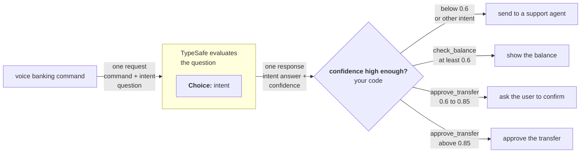

> ## Documentation Index
> Fetch the complete documentation index at: https://docs.typesafe.ai/llms.txt
> Use this file to discover all available pages before exploring further.

# AI primer

> Why TypeSafe trains decision models with calibrated probabilities instead of optimizing for generated text.

Most AI products are built around a conversation between a model and a person. TypeSafe starts from a different bet: large-scale automation will be dominated by AI-to-AI and AI-to-software interactions, so the machine interface matters more than the chat interface.

> **We call this Machine Native Intelligence:**
>
> AI with software-like properties such as structure, reliability, observability, testability, speed, consistency, and low cost.

## Building prod, not God

TypeSafe is not trying to build a model that does everything. It is designed for production systems where code needs a narrow decision it can inspect and act on.

Our expectation is that large-scale AI automation will be closer to 99% machine-to-machine interactions and 1% human interaction. That shifts the design target from responses that feel good to read toward outputs that behave predictably inside software.

Read the [TypeSafe manifesto](https://typesafe.ai/manifesto).

## Three post-training approaches

Pretrained language models have been adapted in two major ways. TypeSafe adds a third. RLHF and RLVR are shown here for context; TypeSafe's training path is RLCD.

<Columns cols={3}>
  <Card title="RLHF" icon="messages-square" type="note">
    **Reinforcement learning from human feedback** turned pretrained models into chatbots. It trains models to produce responses people prefer.
  </Card>

  <Card title="RLVR" icon="brain-circuit" type="note">
    **Reinforcement learning with verifiable rewards** created reasoning models that are strong at tasks such as mathematics, but slower and more expensive.
  </Card>

  <Card title="RLCD" icon="binary" type="tip">
    **Reinforcement learning for calibrated decisions** trains TypeSafe to return decisions and calibrated probabilities instead of generated text.
  </Card>
</Columns>

RLHF was used to train InstructGPT and ChatGPT and was [co-invented by Diogo Almeida](https://scholar.google.com/citations?user=0T4y07QAAAAJ\&hl=en), cofounder of TypeSafe.

<Frame>
  

  
</Frame>

## RLCD and calibrated decisions

RLCD optimizes for a different output contract:

* The model does not generate text.
* It returns decisions and probabilities.
* Higher probability should correspond to a greater chance that the answer is correct.

Calibration makes uncertainty usable by software. Across many predictions from a well-calibrated model:

* Outcomes assigned a probability of `0.2` should occur about 20% of the time.
* Outcomes assigned a probability of `0.8` should occur about 80% of the time.
* Outcomes assigned a probability of `1.0` should occur 100% of the time.

These rates describe groups of predictions, not a guarantee about any single answer. See [Confidence](/confidence) for guidance on deciding when software should act or escalate.

## The problems with RLHF

RLHF teaches a model to say things that people prefer. That objective works well for chatbots, but it can also reward sycophancy and confident-sounding hallucinations.

Preference optimization also causes **mode dropping**: the model learns to favor a particular style, such as instruction following, while reducing the probability of other possible outputs.

<Frame>
  

  
</Frame>

<Warning>
  An output can be compelling to a person without being reliable enough for unattended automation. Human preference and machine trustworthiness are different optimization targets.
</Warning>

Mode dropping is a milder version of **mode collapse**. In the classic generative-adversarial-network failure mode, a generator learns to produce the same kind of output repeatedly because that output continues to fool the discriminator.

<Accordion title="Mode collapse analogy">
  <Frame>
    

    
  </Frame>
</Accordion>

RLHF remains a good fit for conversational models. TypeSafe's position is that production automation needs a different training objective—one centered on constrained decisions and calibrated uncertainty.
> ## Documentation Index
> Fetch the complete documentation index at: https://docs.typesafe.ai/llms.txt
> Use this file to discover all available pages before exploring further.

# Confidence

> How TypeSafe reports certainty, how it differs from probability, and how to use it to control system behavior.

export function ConfidenceExplorer() {
  const [probabilities, setProbabilities] = useState([90, 6, 4]);
  const options = ["A", "B", "C"];
  function changeProbability(index, value) {
    setProbabilities(current => {
      const others = [0, 1, 2].filter(i => i !== index);
      const remaining = 100 - value;
      const previousRemaining = current[others[0]] + current[others[1]];
      const next = [...current];
      next[index] = value;
      next[others[0]] = previousRemaining > 0 ? remaining * current[others[0]] / previousRemaining : remaining / 2;
      next[others[1]] = remaining - next[others[0]];
      return next;
    });
  }
  function formatProbability(value) {
    if (Math.abs(value - 100 / 3) < 0.000001) return "33⅓%";
    return `${Number(value.toFixed(1))}%`;
  }
  function choiceConfidence(values) {
    const count = values.length;
    const peak = Math.max(...values) / 100;
    return Math.max(0, Math.min(1, (count * peak - 1) / (count - 1)));
  }
  const confidence = choiceConfidence(probabilities);
  const maximum = Math.max(...probabilities);
  const winners = options.filter((option, i) => Math.abs(probabilities[i] - maximum) < 0.000001);
  const selected = winners.length === 1 ? `Option ${winners[0]}` : `Tie: ${winners.join(", ")}`;
  const buttonClass = "border px-3 py-2 text-sm hover:bg-zinc-100 dark:hover:bg-zinc-800 focus-visible:outline focus-visible:outline-2 focus-visible:outline-offset-2 focus-visible:outline-pink-500";
  const buttonStyle = {
    borderColor: "#71717a"
  };
  const eyebrow = {
    fontSize: "0.6875rem",
    fontWeight: 700,
    letterSpacing: "0.08em",
    textTransform: "uppercase"
  };
  return <section aria-label="Explore probabilities and confidence" className="not-prose my-6 border border-zinc-300 dark:border-zinc-700 p-5 sm:p-6 text-zinc-800 dark:text-zinc-200">
      <div className="flex flex-wrap items-start justify-between gap-4">
        <div>
          <div className="text-zinc-600 dark:text-zinc-400" style={eyebrow}>Choice question with three options</div>
          <div className="mt-2 text-base font-semibold">See how probability distribution changes confidence</div>
        </div>
        <div className="text-right" role="status" aria-live="polite" aria-atomic="true">
          <div className="text-sm text-zinc-600 dark:text-zinc-400">Confidence</div>
          <output className="block text-3xl font-semibold tabular-nums" style={{
    color: "#E551BA"
  }}>
            {confidence.toFixed(2)}
          </output>
        </div>
      </div>

      <div role="img" aria-label={`Probability distribution: ${options.map((option, i) => `${option} ${formatProbability(probabilities[i])}`).join(", ")}. ${selected}.`} className="my-6">
        <div className="text-xs text-zinc-600 dark:text-zinc-400">Probability</div>
        <div aria-hidden="true" style={{
    position: "relative",
    height: "180px",
    margin: "34px 0 36px 44px"
  }}>
          {[0, 50, 100].map(tick => <div key={tick} style={{
    position: "absolute",
    bottom: `${tick}%`,
    width: "100%",
    borderBottom: "1px solid",
    borderColor: "color-mix(in srgb, currentColor 18%, transparent)"
  }}>
              <span className="text-xs" style={{
    position: "absolute",
    right: "calc(100% + 8px)",
    transform: "translateY(-50%)"
  }}>{tick}%</span>
            </div>)}
          <div style={{
    position: "absolute",
    inset: 0,
    display: "flex",
    justifyContent: "space-around",
    alignItems: "flex-end"
  }}>
            {options.map((option, index) => <div key={option} style={{
    position: "relative",
    width: "21%",
    height: `${probabilities[index]}%`
  }}>
                <span className="text-sm font-semibold tabular-nums" style={{
    position: "absolute",
    bottom: "calc(100% + 6px)",
    left: "50%",
    transform: "translateX(-50%)",
    whiteSpace: "nowrap"
  }}>{formatProbability(probabilities[index])}</span>
                <div style={{
    height: "100%",
    background: winners.length === 1 && winners[0] === option ? "#E551BA" : "currentColor",
    opacity: winners.length === 1 && winners[0] === option ? 1 : 0.45
  }} />
                <span className="text-sm" style={{
    position: "absolute",
    top: "calc(100% + 8px)",
    left: "50%",
    transform: "translateX(-50%)"
  }}>{option}</span>
              </div>)}
          </div>
        </div>
      </div>

      <div className="space-y-3">
        {options.map((option, index) => <label key={option} className="flex items-center gap-3 text-sm">
            <span className="w-5 font-semibold">{option}</span>
            <input type="range" min="0" max="100" step="1" value={probabilities[index]} onChange={event => changeProbability(index, Number(event.target.value))} aria-label={`Probability of ${option}`} aria-valuetext={formatProbability(probabilities[index])} className="min-w-0 flex-1 cursor-pointer" style={{
    accentColor: "#E551BA",
    minHeight: "44px"
  }} />
            <output className="w-16 text-right tabular-nums">{formatProbability(probabilities[index])}</output>
          </label>)}
      </div>
      <p className="mt-3 text-sm text-zinc-600 dark:text-zinc-400">Move a slider to change an option's probability. The other probabilities adjust to keep the total at 100%.</p>

      <div className="mt-4 flex flex-wrap gap-2" aria-label="Example distributions">
        <button type="button" className={buttonClass} style={buttonStyle} onClick={() => setProbabilities([90, 6, 4])}>Clear winner</button>
        <button type="button" className={buttonClass} style={buttonStyle} onClick={() => setProbabilities([40, 33, 27])}>Spread out</button>
        <button type="button" className={buttonClass} style={buttonStyle} onClick={() => setProbabilities([100 / 3, 100 / 3, 100 / 3])}>Even split</button>
      </div>
      <div className="mt-4 text-sm" aria-live="polite">{winners.length === 1 ? `Selected: ${selected}` : selected}</div>
      <details className="mt-4 text-sm text-zinc-600 dark:text-zinc-400">
        <summary className="cursor-pointer">How this demo calculates Confidence</summary>
        <p className="mt-3">TypeSafe computes confidence from how the probability is spread across the options. All of it on one option gives 1.0; the more evenly it spreads, the lower the confidence. This demo uses <code>(3 × largest probability − 1) / 2</code> to approximate confidence for three options.</p>
      </details>
    </section>;
}

All Score and Choice answers from TypeSafe include a `probabilities` property representing the probability distribution across the options (for Choice) or levels (for Score). The *shape* of that distribution is what tells you how certain the model is: concentrated on one outcome means a confident answer, spread out means an uncertain one.

The answer's `confidence` property collapses that shape into a single number from 0 to 1, so you can threshold on it without doing the math yourself. (Noul answers don't carry one.)

## Confidence is derived from the probabilities

`confidence` is a statistic computed from the probability distribution the answer already gives you. TypeSafe computes it for you and returns it on every Choice and Score answer, so the common case needs no extra work on your side.

<ConfidenceExplorer />

<Note>
  **A solid default:** We provide `confidence` as a convenient measure that fits most use-cases, but you are never locked into our definition. Depending on what you are evaluating, a different measure may serve you better, which is exactly why we give you the full `probabilities` in the response. The pros and cons of different computations is a specialized topic that we'll keep to a separate cookbook rather than this page, and will add the link here when we do!
</Note>

For a [Choice](/primitives/choice), the distribution is `probabilities` across your options. For a [Score](/primitives/score), it is the distribution across your levels. In both cases a flatter distribution means lower confidence: low confidence on a Choice often means none of the options are a clear winner over the others, and low confidence on a Score often means the levels are ambiguous, multi-dimensional, or the state doesn't contain enough to go on.

## "I don't know" is a useful signal

If an intelligent system, whether human or machine, cannot express honest uncertainty, the system cannot be trusted.

Confidence gives you a built-in mechanism for the model to say "I'm not sure about this one." This lets your code implement different behavior for different levels of certainty, which is the foundation for building systems you can actually rely on.

## Three paths for using confidence in your code

A useful starting pattern is to divide confidence into three ranges, each producing a different system behavior:

**High confidence:** Act automatically. The model has a clear read and you can proceed without human involvement.

**Medium confidence:** Proceed with caution. The model has a reasonable answer but is not certain. Depending on context, you might ask the user to confirm, flag for review, or gather more information before acting.

**Low confidence:** Do not act. Route to a human, request clarification, or fall back to a different system. The model is telling you it does not have enough information or the question is not a good fit.

Where you draw those boundaries depends on the stakes.

## Thresholds scale with risk

A confidence threshold is not one number. Different actions within the same system should be gated at different levels depending on the consequences of getting it wrong.

```python theme={null}
response = client.system_one(
    state=user_message,
    questions={
        "action": Choice(
            instructions="What is the user trying to do?",
            criteria={
                "check_balance": "View account balance",
                "approve_transfer": "Approve the pending withdrawal request",
                "support": "Get help with an issue",
            },
        ),
    },
)

action = response.answers["action"]
confidence = action.confidence

if confidence < 0.5:
    # Model is genuinely unsure. Don't guess.
    route_to_human(user_message)

elif action.choice == "check_balance":
    # Low stakes. Showing the wrong screen is recoverable.
    show_balance(account_id)

elif action.choice == "approve_transfer":
    if confidence > 0.9:
        # High stakes, high confidence. Proceed with confirmation.
        confirm_then_execute(account_id)
    else:
        # High stakes, moderate confidence. Verify first.
        ask_user_to_confirm(account_id)
```

The 0.5 confidence floor catches anything the model reports as genuinely uncertain. Above that, the threshold for acting without confirmation is higher for a destructive operation than for a read-only one. Your code encodes the risk tolerance.

<Note>
  The correct threshold values depend on your domain and the performance of the model for your use case. Start with conservative thresholds, test with your own data, and adjust as you observe results.
</Note>
> ## Documentation Index
> Fetch the complete documentation index at: https://docs.typesafe.ai/llms.txt
> Use this file to discover all available pages before exploring further.

# How to build with TypeSafe

> Design AI-powered software by keeping code in control and giving System One narrow, structured decisions.

export function TypesafeExample({example, display, title}) {
  const keyStrUriSafe = "ABCDEFGHIJKLMNOPQRSTUVWXYZabcdefghijklmnopqrstuvwxyz0123456789+-$";
  function compressToEncodedURIComponent(input) {
    if (input == null) return "";
    return _compress(input, 6, function (a) {
      return keyStrUriSafe.charAt(a);
    });
  }
  function _compress(uncompressed, bitsPerChar, getCharFromInt) {
    if (uncompressed == null) return "";
    var i, value, context_dictionary = {}, context_dictionaryToCreate = {}, context_c = "", context_wc = "", context_w = "", context_enlargeIn = 2, context_dictSize = 3, context_numBits = 2, context_data = [], context_data_val = 0, context_data_position = 0, ii;
    for (ii = 0; ii < uncompressed.length; ii += 1) {
      context_c = uncompressed.charAt(ii);
      if (!Object.prototype.hasOwnProperty.call(context_dictionary, context_c)) {
        context_dictionary[context_c] = context_dictSize++;
        context_dictionaryToCreate[context_c] = true;
      }
      context_wc = context_w + context_c;
      if (Object.prototype.hasOwnProperty.call(context_dictionary, context_wc)) {
        context_w = context_wc;
      } else {
        if (Object.prototype.hasOwnProperty.call(context_dictionaryToCreate, context_w)) {
          if (context_w.charCodeAt(0) < 256) {
            for (i = 0; i < context_numBits; i++) {
              context_data_val = context_data_val << 1;
              if (context_data_position == bitsPerChar - 1) {
                context_data_position = 0;
                context_data.push(getCharFromInt(context_data_val));
                context_data_val = 0;
              } else {
                context_data_position++;
              }
            }
            value = context_w.charCodeAt(0);
            for (i = 0; i < 8; i++) {
              context_data_val = context_data_val << 1 | value & 1;
              if (context_data_position == bitsPerChar - 1) {
                context_data_position = 0;
                context_data.push(getCharFromInt(context_data_val));
                context_data_val = 0;
              } else {
                context_data_position++;
              }
              value = value >> 1;
            }
          } else {
            value = 1;
            for (i = 0; i < context_numBits; i++) {
              context_data_val = context_data_val << 1 | value;
              if (context_data_position == bitsPerChar - 1) {
                context_data_position = 0;
                context_data.push(getCharFromInt(context_data_val));
                context_data_val = 0;
              } else {
                context_data_position++;
              }
              value = 0;
            }
            value = context_w.charCodeAt(0);
            for (i = 0; i < 16; i++) {
              context_data_val = context_data_val << 1 | value & 1;
              if (context_data_position == bitsPerChar - 1) {
                context_data_position = 0;
                context_data.push(getCharFromInt(context_data_val));
                context_data_val = 0;
              } else {
                context_data_position++;
              }
              value = value >> 1;
            }
          }
          context_enlargeIn--;
          if (context_enlargeIn == 0) {
            context_enlargeIn = Math.pow(2, context_numBits);
            context_numBits++;
          }
          delete context_dictionaryToCreate[context_w];
        } else {
          value = context_dictionary[context_w];
          for (i = 0; i < context_numBits; i++) {
            context_data_val = context_data_val << 1 | value & 1;
            if (context_data_position == bitsPerChar - 1) {
              context_data_position = 0;
              context_data.push(getCharFromInt(context_data_val));
              context_data_val = 0;
            } else {
              context_data_position++;
            }
            value = value >> 1;
          }
        }
        context_enlargeIn--;
        if (context_enlargeIn == 0) {
          context_enlargeIn = Math.pow(2, context_numBits);
          context_numBits++;
        }
        context_dictionary[context_wc] = context_dictSize++;
        context_w = String(context_c);
      }
    }
    if (context_w !== "") {
      if (Object.prototype.hasOwnProperty.call(context_dictionaryToCreate, context_w)) {
        if (context_w.charCodeAt(0) < 256) {
          for (i = 0; i < context_numBits; i++) {
            context_data_val = context_data_val << 1;
            if (context_data_position == bitsPerChar - 1) {
              context_data_position = 0;
              context_data.push(getCharFromInt(context_data_val));
              context_data_val = 0;
            } else {
              context_data_position++;
            }
          }
          value = context_w.charCodeAt(0);
          for (i = 0; i < 8; i++) {
            context_data_val = context_data_val << 1 | value & 1;
            if (context_data_position == bitsPerChar - 1) {
              context_data_position = 0;
              context_data.push(getCharFromInt(context_data_val));
              context_data_val = 0;
            } else {
              context_data_position++;
            }
            value = value >> 1;
          }
        } else {
          value = 1;
          for (i = 0; i < context_numBits; i++) {
            context_data_val = context_data_val << 1 | value;
            if (context_data_position == bitsPerChar - 1) {
              context_data_position = 0;
              context_data.push(getCharFromInt(context_data_val));
              context_data_val = 0;
            } else {
              context_data_position++;
            }
            value = 0;
          }
          value = context_w.charCodeAt(0);
          for (i = 0; i < 16; i++) {
            context_data_val = context_data_val << 1 | value & 1;
            if (context_data_position == bitsPerChar - 1) {
              context_data_position = 0;
              context_data.push(getCharFromInt(context_data_val));
              context_data_val = 0;
            } else {
              context_data_position++;
            }
            value = value >> 1;
          }
        }
        context_enlargeIn--;
        if (context_enlargeIn == 0) {
          context_enlargeIn = Math.pow(2, context_numBits);
          context_numBits++;
        }
        delete context_dictionaryToCreate[context_w];
      } else {
        value = context_dictionary[context_w];
        for (i = 0; i < context_numBits; i++) {
          context_data_val = context_data_val << 1 | value & 1;
          if (context_data_position == bitsPerChar - 1) {
            context_data_position = 0;
            context_data.push(getCharFromInt(context_data_val));
            context_data_val = 0;
          } else {
            context_data_position++;
          }
          value = value >> 1;
        }
      }
      context_enlargeIn--;
      if (context_enlargeIn == 0) {
        context_enlargeIn = Math.pow(2, context_numBits);
        context_numBits++;
      }
    }
    value = 2;
    for (i = 0; i < context_numBits; i++) {
      context_data_val = context_data_val << 1 | value & 1;
      if (context_data_position == bitsPerChar - 1) {
        context_data_position = 0;
        context_data.push(getCharFromInt(context_data_val));
        context_data_val = 0;
      } else {
        context_data_position++;
      }
      value = value >> 1;
    }
    while (true) {
      context_data_val = context_data_val << 1;
      if (context_data_position == bitsPerChar - 1) {
        context_data.push(getCharFromInt(context_data_val));
        break;
      } else context_data_position++;
    }
    return context_data.join("");
  }
  function buildHref(ex) {
    const documentText = ex.state === undefined ? "" : typeof ex.state === "string" ? ex.state : JSON.stringify(ex.state, null, 2);
    return "https://console.typesafe.ai/decode#share/" + compressToEncodedURIComponent(JSON.stringify({
      apiVersion: "v1",
      documentText,
      promptsText: JSON.stringify(ex.questions, null, 2),
      selectedModels: ex.selectedModels
    }));
  }
  const displayedExample = display === "questions" ? example.questions : example.state === undefined ? {
    questions: example.questions
  } : {
    state: example.state,
    questions: example.questions
  };
  const code = JSON.stringify(displayedExample, null, 2);
  const href = buildHref(example);
  return <div style={{
    margin: "1.25rem 0"
  }}>
      <CodeBlock language="json" filename={title ?? "request"}>
        {code}
      </CodeBlock>
      <div className="pb-8">
        <a href={href} target="_blank" rel="noreferrer" className="text-primary">
          Try it in the Playground →
        </a>
      </div>
    </div>;
}

System One is TypeSafe's model for building AI-powered software, not agents. It does not generate code or choose its own next action. It provides AI primitives that embed into software, so code remains in control while the model handles common-sense judgments over unstructured data.

<Info>
  **Summary:** build a normal software workflow and insert System One only where AI is needed.

  * Keep control flow, deterministic rules, and side effects in code.
  * Break broad judgments into narrow, typed questions with explicit instructions and criteria.
  * Give each question only the context it needs.
  * Use probabilities and confidence to act, ask for review, or escalate.
  * Ask independent questions together, then compose their answers in code.
</Info>

## Three software architectures

TypeSafe is designed for building **AI-powered software**, where code owns the workflow and AI handles narrow, structured decisions.

<Tabs>
  <Tab title="Traditional software">
    Traditional code is a complex decision tree made from simple software primitives. Because each primitive is reliable, developers can compose them into higher-level abstractions.
  </Tab>

  <Tab title="LLM agents">
    An agent processes instructions and chooses its next step. This works well when a person is monitoring the process, but every loop introduces another opportunity to go off the rails.
  </Tab>

  <Tab title="AI-powered software">
    Code handles deterministic work and owns the control flow. The model appears only where the system needs programmable common sense or needs to interpret unstructured data. Each AI task is kept atomic and constrained.
  </Tab>
</Tabs>

<Frame>
  

  
</Frame>

## What makes System One composable

<Columns cols={2}>
  <Card title="Structured" icon="braces">
    System One is type-safe by construction. Decisions and probabilities conform to the structured software types and JSON schema your code expects, so it never has to recover a value from generated prose.
  </Card>

  <Card title="Parallel" icon="split">
    Questions are evaluated independently and in parallel. One primitive's result does not become hidden context that changes another primitive's result.
  </Card>

  <Card title="Comparable" icon="arrow-up-down">
    Outputs are sortable and can drive smart `if` statements, thresholds, and comparisons.
  </Card>

  <Card title="Fast" icon="gauge">
    Most queries complete in about 100 ms. System One is fast enough for real-time request paths and user interfaces.
  </Card>

  <Card title="Calibrated confidence" icon="chart-no-axes-combined">
    [RLCD](/introduction/machine-learning-primer) communicates uncertainty through calibrated probabilities instead of tending toward overconfidence.
  </Card>

  <Card title="Self-consistent" icon="repeat-2">
    System One is designed to return stable answers across repeated evaluations. See the [self-consistency cookbook](/cookbooks/consistency_noul_cookbook).
  </Card>
</Columns>

Because every output is constrained to the supplied options, the model returns a full probability distribution over those options rather than inventing a value outside the schema. TypeSafe's target is a greater than 100× intelligence-to-speed-and-cost ratio; the underlying bet is that cheaper intelligence will create much more demand.

## Design a System One workflow

<Steps titleSize="h3">
  <Step title="Use code when you can">
    Keep deterministic work in code. It is reliable and cheap. Avoid agent `while` loops when a software workflow can express the same behavior.

    <Accordion title="Example: keep deterministic rules in code">
      ```python theme={null}
      days_overdue = (today - invoice.due_date).days

      if days_overdue > 30:
          route_to_collections(invoice)
      ```
    </Accordion>

    Browse the [System One patterns](/patterns) for bounded ways to compose model decisions with code.
  </Step>

  <Step title="Decompose the input state">
    Include only the context relevant to the current questions. This helps the model avoid distractions and context rot. Do not rely on knowledge stored in model weights when current information can come from your own knowledge base.

    <Accordion title="Example: send only relevant context">
      <TypesafeExample
        title="request"
        display="request"
        example={{
      state: {
        ticket_message: 'My flight was cancelled. Can I get a refund?',
        refund_policy: 'Cancelled flights are eligible for a full refund.',
      },
      selectedModels: ['jev-latest'],
      questions: {
        policy_supports_refund: {
          type: 'noul',
          instructions:
            'Does the refund policy support the refund requested in the ticket?',
        },
      },
    }}
      />
    </Accordion>
  </Step>

  <Step title="Use structure in the input state">
    Use nested JSON for the `state` and `questions` fields. Point questions at specific values when that removes ambiguity, and include the backtick characters around each path inside the question.

    <Accordion title="Example: reference a nested value">
      Use a backticked dot-and-index path to point a question at a specific nested value, such as `support.tickets[0].message`.

      <TypesafeExample
        title="request"
        display="request"
        example={{
      state: {
        support: {
          tickets: [
            { message: 'I was charged twice for order A-104.' },
            { message: 'How do I reset my password?' },
          ],
        },
        commerce: {
          orders: [
            {
              id: 'A-104',
              charges: [
                { amount_usd: 49, status: 'captured' },
                { amount_usd: 49, status: 'captured' },
              ],
            },
          ],
        },
        account: {
          security: {
            password_reset:
              'Email a reset link to the address on file.',
          },
        },
      },
      selectedModels: ['jev-latest'],
      questions: {
        duplicate_charge: {
          type: 'noul',
          instructions:
            'Do `support.tickets[0].message` and `commerce.orders[0].charges` indicate a duplicate charge?',
        },
        password_reset_supported: {
          type: 'noul',
          instructions:
            'Can `account.security.password_reset` resolve the request in `support.tickets[1].message`?',
        },
      },
    }}
      />
    </Accordion>
  </Step>

  <Step title="Decompose the questions">
    Ask the most explicit, narrow, specific, atomic questions you can. Break down complex or ill-defined questions into separate questions that each evaluate one property.

    <Info>
      This is probably the most important concept in this guide. Broad questions hide several judgments behind one answer. Atomic questions expose those judgments so you can inspect, tune, and combine them in code.
    </Info>

    <Accordion title="Example: decompose spam detection">
      <TypesafeExample
        title="One broad question (bad)"
        display="questions"
        example={{
      state: {
        message: {
          sender: {
            display_name: 'Acme Payroll',
            email: 'rewards@claim-bonus.example',
          },
          subject: 'Urgent: claim your employee bonus',
          body:
            'You have been selected for a $1,000 bonus. Confirm your payroll password today to receive it.',
          links: [
            {
              text: 'Claim bonus',
              url: 'http://claim-bonus.example/acme',
            },
          ],
        },
      },
      selectedModels: ['jev-latest'],
      questions: {
        is_spam: {
          type: 'noul',
          instructions: 'Is `message` spam?',
        },
      },
    }}
      />

      <TypesafeExample
        title="Decomposed questions (good)"
        display="questions"
        example={{
      state: {
        message: {
          sender: {
            display_name: 'Acme Payroll',
            email: 'rewards@claim-bonus.example',
          },
          subject: 'Urgent: claim your employee bonus',
          body:
            'You have been selected for a $1,000 bonus. Confirm your payroll password today to receive it.',
          links: [
            {
              text: 'Claim bonus',
              url: 'http://claim-bonus.example/acme',
            },
          ],
        },
      },
      selectedModels: ['jev-latest'],
      questions: {
        requests_credentials: {
          type: 'noul',
          instructions:
            'Does `message.body` ask the recipient to provide a password or other login credential?',
        },
        offers_unexpected_reward: {
          type: 'noul',
          instructions:
            'Does `message.body` claim the recipient received an unexpected prize, payment, or reward?',
        },
        creates_time_pressure: {
          type: 'noul',
          instructions:
            'Does `message.subject` or `message.body` pressure the recipient to act quickly?',
        },
        sender_identity_mismatch: {
          type: 'noul',
          instructions:
            'Does the organization named in `message.sender.display_name` conflict with the domain in `message.sender.email`?',
        },
        link_domain_mismatch: {
          type: 'noul',
          instructions:
            'Does the domain in `message.links[0].url` conflict with the organization named in `message.sender.display_name`?',
        },
        disguises_link_destination: {
          type: 'noul',
          instructions:
            'Does `message.links[0].text` conceal or misrepresent the destination in `message.links[0].url`?',
        },
      },
    }}
      />
    </Accordion>

    <Accordion title="Example: verify a tool-call trace">
      <TypesafeExample
        title="One broad question (bad)"
        display="questions"
        example={{
      state: {
        request: {
          text: "What's the weather in Seattle tomorrow in Fahrenheit?",
          location: 'Seattle, WA',
          date: '2026-09-03',
          unit: 'fahrenheit',
        },
        available_tools: {
          geocode_city: {
            description: 'Resolve a city to latitude and longitude.',
            parameters: { city: 'string' },
          },
          get_weather: {
            description: 'Get the forecast for coordinates and a date.',
            parameters: {
              latitude: 'number',
              longitude: 'number',
              date: 'YYYY-MM-DD',
              unit: ['fahrenheit', 'celsius'],
            },
          },
        },
        trace: {
          tool_calls: [
            {
              id: 'call_1',
              name: 'geocode_city',
              arguments: { city: 'Seattle, WA' },
            },
            {
              id: 'call_2',
              name: 'get_weather',
              arguments: {
                latitude: 47.6062,
                longitude: -122.3321,
                date: '2026-09-03',
                unit: 'celsius',
              },
            },
          ],
          tool_results: [
            {
              tool_call_id: 'call_1',
              output: { latitude: 47.6062, longitude: -122.3321 },
            },
          ],
        },
      },
      selectedModels: ['jev-latest'],
      questions: {
        tool_calls_are_correct: {
          type: 'noul',
          instructions:
            'Is `trace.tool_calls` correct for `request` and `available_tools`?',
        },
      },
    }}
      />

      <TypesafeExample
        title="Decomposed questions (good)"
        display="questions"
        example={{
      state: {
        request: {
          text: "What's the weather in Seattle tomorrow in Fahrenheit?",
          location: 'Seattle, WA',
          date: '2026-09-03',
          unit: 'fahrenheit',
        },
        available_tools: {
          geocode_city: {
            description: 'Resolve a city to latitude and longitude.',
            parameters: { city: 'string' },
          },
          get_weather: {
            description: 'Get the forecast for coordinates and a date.',
            parameters: {
              latitude: 'number',
              longitude: 'number',
              date: 'YYYY-MM-DD',
              unit: ['fahrenheit', 'celsius'],
            },
          },
        },
        trace: {
          tool_calls: [
            {
              id: 'call_1',
              name: 'geocode_city',
              arguments: { city: 'Seattle, WA' },
            },
            {
              id: 'call_2',
              name: 'get_weather',
              arguments: {
                latitude: 47.6062,
                longitude: -122.3321,
                date: '2026-09-03',
                unit: 'celsius',
              },
            },
          ],
          tool_results: [
            {
              tool_call_id: 'call_1',
              output: { latitude: 47.6062, longitude: -122.3321 },
            },
          ],
        },
      },
      selectedModels: ['jev-latest'],
      questions: {
        geocode_tool_is_relevant: {
          type: 'noul',
          instructions:
            'Is `trace.tool_calls[0].name` an appropriate tool for resolving `request.location`?',
        },
        geocode_location_matches: {
          type: 'noul',
          instructions:
            'Does `trace.tool_calls[0].arguments.city` match `request.location`?',
        },
        geocode_arguments_match_schema: {
          type: 'noul',
          instructions:
            'Does `trace.tool_calls[0].arguments` conform to `available_tools.geocode_city.parameters`?',
        },
        geocode_result_matches_call: {
          type: 'noul',
          instructions:
            'Does `trace.tool_results[0].tool_call_id` match `trace.tool_calls[0].id`?',
        },
        weather_tool_is_relevant: {
          type: 'noul',
          instructions:
            'Is `trace.tool_calls[1].name` an appropriate tool for answering `request.text`?',
        },
        weather_arguments_match_schema: {
          type: 'noul',
          instructions:
            'Does `trace.tool_calls[1].arguments` conform to `available_tools.get_weather.parameters`?',
        },
        weather_uses_geocoded_coordinates: {
          type: 'noul',
          instructions:
            'Do the coordinates in `trace.tool_calls[1].arguments` match those in `trace.tool_results[0].output`?',
        },
        weather_date_matches: {
          type: 'noul',
          instructions:
            'Does `trace.tool_calls[1].arguments.date` match `request.date`?',
        },
        weather_unit_matches: {
          type: 'noul',
          instructions:
            'Does `trace.tool_calls[1].arguments.unit` match `request.unit`?',
        },
      },
    }}
      />
    </Accordion>
  </Step>

  <Step title="Use structure in the questions">
    Keep questions short. `instructions` and `criteria` are usually strings, and for a short, unambiguous question a string is all you need. They can also be objects or arrays. Put the question in one field and the data that guides the question in the others.

    Structure helps in these situations:

    * The question needs context or examples. A long sentence of background information or a list of example inputs belongs in named fields next to the question, where your code can add to them or swap them without rewriting the question.
    * Part of the question comes from your code. When a value comes from a database, put it in its own field instead of splicing it into a string template.
    * Several questions have similar instructions. A request takes one state and can include multiple questions. Adding supplementary data can help make questions distinct.

    <Accordion title="Example: reference a record from your code">
      This Noul compares a resume in the state against a record from a candidate database. The record goes into `potential_duplicate` as it is, and the question refers to it by name.

      <TypesafeExample
        title="questions"
        display="questions"
        example={{
      state: {
        resume: {
          name: 'John Smith',
          location: 'Oakland, CA',
          summary: 'Backend engineer with eight years of Python and Go experience.',
          experience: [
            { employer: 'Google', title: 'Senior Backend Engineer', years: '2021-2025' },
            { employer: 'Microsoft', title: 'Software Engineer', years: '2017-2021' },
          ],
        },
      },
      selectedModels: ['jev-latest'],
      questions: {
        same_as_record_18: {
          type: 'noul',
          instructions: {
            potential_duplicate: { name: 'John Smith', location: 'Oakland, California', last_employer: 'Google' },
            question: 'Is the resume for the same person as `potential_duplicate`?',
          },
        },
      },
    }}
      />
    </Accordion>

    The "potential\_duplicate" data sourced from code can change over time. The "question" references it using backticks.

    The descriptions inside `criteria` can be objects too. For a Choice, each option's description can be an object that says what the option covers, what belongs to a different option, and a few examples. Use the same field names across options so the model can compare them directly.

    <Accordion title="Example: define contrastive Choice criteria">
      <TypesafeExample
        title="questions"
        display="questions"
        example={{
      state: 'How many disposable virtual cards can I make per day?',
      selectedModels: ['jev-latest'],
      questions: {
        card_help_topic: {
          type: 'choice',
          instructions: {
            question:
              'Which disposable virtual card topic is the user asking about?',
            focus: 'Classify the information the user wants.',
          },
          criteria: {
            get_disposable_virtual_card: {
              what: 'Purpose, eligibility, or setup',
              not_for: 'Quantity, transaction, or merchant restrictions',
              examples: [
                'How can I get a disposable virtual card?',
                'What are disposable cards for?',
              ],
            },
            disposable_card_limits: {
              what: 'Quantity, transaction, or merchant restrictions',
              not_for: 'Purpose, eligibility, or setup',
              examples: [
                'How many disposable cards can I make per day?',
                'Where can I use a disposable card?',
              ],
            },
          },
        },
      },
    }}
      />
    </Accordion>

    Each question type's page has a worked example:

    * [Noul](/primitives/noul#structured-instructions) compares one resume against several candidate records, one question per record, with the questions built in code.
    * [Choice](/primitives/choice#structured-instructions-and-criteria) describes two easily confused options with what each covers, what it's not for, and examples.
    * [Score](/primitives/score#structured-level-descriptions) gives each level a description and example situations.

    The [structured-data-extraction cascade cookbook](/cookbooks/sde_cascade) shows the shared-wording case, asking the same battery of questions about every field of an extracted record.

    A short, unambiguous question or criterion can remain a string. Add structure when it separates guidance that would otherwise blur together. For the full set of places structure is accepted, see [Advanced: structure](/primitives/advanced).
  </Step>

  <Step title="Ask a lot of questions">
    Ask many narrow, independent questions about the same state in one request. This is how you maximize effectiveness and intelligence per dollar with the API: questions run in parallel, and code can combine their signals without adding serial model round trips.

    See the [Speculative Fan-Out pattern](/patterns/fan-out) and [Parallel questions cookbook](/cookbooks/parallel_questions).
  </Step>

  <Step title="Combine question outputs in code (or feed into a classical ML model)">
    Combine independent answers with deterministic rules or weighted sums. For learned composition, use the probabilities as features in a downstream classical machine-learning model.

    <Accordion title="Example: combine signals with a weighted score">
      ```python theme={null}
      answers = response.answers

      # Combine independent signals into one application-specific score.
      quality = (
          0.4 * answers["answers_request"].noul
          + 0.4 * answers["citations_are_supported"].noul
          + 0.2 * (1 - answers["contradicts_context"].noul)
      )
      ```
    </Accordion>

    [Composite Scoring](/patterns/composite-scoring) shows how to preserve individual judgments while combining them. If you do not have labels for a downstream model, use an ensemble of expensive reasoning models to generate them; the [AutoResearch cookbook](/cookbooks/autoresearch_feature_discovery) shows how to train a classical model on System One outputs.
  </Step>

  <Step title="Route on uncertainty">
    Make code take different actions for confident and unconfident answers. Escalate uncertain cases to a person or a more expensive reasoning model. Test thresholds by plotting confidence against accuracy on your data.

    <Accordion title="Example: route by confidence">
      ```python theme={null}
      answer = response.answers["card_help_topic"]

      if answer.confidence < 0.8:
          route_to_human_review(ticket)
      else:
          route_to_handler(answer.choice, ticket)
      ```
    </Accordion>

    See [Confidence](/confidence) and [Confidence-Gated Routing](/patterns/confidence-routing) for choosing thresholds and matching them to the risk of each action.
  </Step>
</Steps>

<Tip>
  Decomposition does not require more round trips. Questions over the same state run in parallel.
</Tip>

## Putting it all together

This support-ticket workflow keeps deterministic work in code, sends only relevant structured context, evaluates many atomic questions in one request, and composes the answers with explicit confidence gates.

```python title="triage_ticket.py" theme={null}
from typesafe_sdk import Choice, Noul, NoulCriteria, Score, TypeSafeClient


def triage_ticket(ticket, customer):
    # Handle deterministic states without calling a model.
    if ticket["status"] == "closed":
        return "no_action"

    open_orders = [
        order for order in customer["orders"] if order["status"] != "delivered"
    ]

    # Include only the structured context needed by the questions below.
    state = {
        "ticket": {
            "message": ticket["message"],
            "sender": ticket["sender"],
            "links": ticket["links"],
        },
        "customer": {
            "plan": customer["plan"],
            "open_orders": open_orders,
        },
        "policy": {
            "sensitive_credentials": ["password", "security code", "API key"],
        },
    }

    # Ask structured, atomic questions together so they run in parallel.
    questions = {
        "topic": Choice(
            instructions={
                "question": "Which team should handle `ticket.message`?",
                "focus": "Classify the customer's primary request.",
            },
            criteria={
                "billing": {
                    "what": "Charges, invoices, refunds, or subscriptions",
                    "not_for": "Order tracking or account access",
                    "examples": ["I was charged twice", "Where is my refund?"],
                },
                "orders": {
                    "what": "Order status, delivery, cancellation, or returns",
                    "not_for": "Charges or account access",
                    "examples": ["Where is my order?", "Cancel my shipment"],
                },
                "account": {
                    "what": "Login, profile, permissions, or security",
                    "not_for": "Charges or order tracking",
                    "examples": ["Reset my password", "I cannot sign in"],
                },
            },
        ),
        "requests_credentials": Noul(
            instructions={
                "question": "Does the message request a sensitive credential?",
                "compare": [
                    "`ticket.message`",
                    "`policy.sensitive_credentials`",
                ],
                "focus": "Look for a request to disclose the credential itself.",
            },
            criteria=NoulCriteria(
                true={
                    "what": "Asks the recipient to disclose a listed credential",
                    "examples": [
                        "Reply with your password",
                        "Send us your API key",
                    ],
                },
                false={
                    "what": "Does not ask the recipient to disclose a credential",
                    "not_for": "A legitimate instruction to reset a credential",
                    "examples": ["Use this link to reset your password"],
                },
            ),
        ),
        "sender_identity_mismatch": Noul(
            instructions={
                "question": "Does the claimed sender identity conflict with its domain?",
                "compare": [
                    "`ticket.sender.display_name`",
                    "`ticket.sender.email`",
                ],
                "focus": "Compare the named organization with the email domain.",
            },
            criteria=NoulCriteria(
                true={
                    "what": "Claims an organization unrelated to the email domain",
                    "examples": ["Acme Payroll sent from claim-bonus.example"],
                },
                false={
                    "what": "The identity and domain agree or make no conflicting claim",
                    "examples": ["Acme Payroll sent from acme.example"],
                },
            ),
        ),
        "unexpected_reward": Noul(
            instructions={
                "question": "Does the message announce an unexpected reward?",
                "inspect": "`ticket.message`",
                "focus": "Look for an unsolicited prize, payment, or reward claim.",
            },
            criteria=NoulCriteria(
                true={
                    "what": "Announces an unrequested prize, payment, or reward",
                    "examples": ["You were selected for a $1,000 bonus"],
                },
                false={
                    "what": "Contains no reward claim or discusses an expected payment",
                    "not_for": "A customer asking about a known refund or payroll deposit",
                    "examples": ["When will my approved refund arrive?"],
                },
            ),
        ),
        "refund_requested": Noul(
            instructions={
                "question": "Does the customer explicitly request a refund or credit?",
                "inspect": "`ticket.message`",
                "focus": "Require a requested remedy, not a billing complaint alone.",
            },
            criteria=NoulCriteria(
                true={
                    "what": "Directly asks for money back or an account credit",
                    "examples": ["Please refund the duplicate charge"],
                },
                false={
                    "what": "Does not ask for a refund or credit",
                    "not_for": "A complaint or billing question without a requested remedy",
                    "examples": ["Why was I charged twice?"],
                },
            ),
        ),
        "mentions_open_order": Noul(
            instructions={
                "question": "Does the message refer to a supplied open order?",
                "compare": [
                    "`ticket.message`",
                    "`customer.open_orders`",
                ],
                "focus": "Match an order id or other identifying details.",
            },
            criteria=NoulCriteria(
                true={
                    "what": "Refers to an open order by id or identifying details",
                    "examples": ["Where is order A-104?"],
                },
                false={
                    "what": "Does not identify any supplied open order",
                    "not_for": "A generic order question with no matching details",
                    "examples": ["How long does shipping usually take?"],
                },
            ),
        ),
        "frustration": Score(
            instructions={
                "question": "How frustrated does the customer appear?",
                "inspect": "`ticket.message`",
                "focus": "Judge expressed frustration, not issue severity.",
            },
            criteria=[
                {
                    "what": "Calm and matter-of-fact",
                    "signals": ["Neutral wording", "No complaint about the experience"],
                },
                {
                    "what": "Frustrated but civil",
                    "signals": ["Expresses annoyance", "Remains constructive"],
                },
                {
                    "what": "Very angry or threatening to leave",
                    "signals": ["Hostile language", "Threatens cancellation or churn"],
                },
            ],
        ),
    }

    with TypeSafeClient() as client:
        response = client.system_one(
            state=state,
            questions=questions,
        )

    # Compose independent spam signals with weights controlled by code.
    answers = response.answers
    spam_risk = (
        0.45 * answers["requests_credentials"].noul
        + 0.30 * answers["sender_identity_mismatch"].noul
        + 0.25 * answers["unexpected_reward"].noul
    )

    # Escalate uncertain judgments instead of guessing.
    spam_is_uncertain = 0.4 < spam_risk < 0.6
    if spam_is_uncertain or answers["topic"].confidence < 0.75:
        return route_to_human_review(ticket)
    if spam_risk >= 0.6:
        return quarantine_as_spam(ticket)

    # Let code decide which speculative answers matter on this path.
    if answers["topic"].choice == "billing":
        return route_to_billing(
            ticket,
            refund_requested=answers["refund_requested"].noul >= 0.7,
        )
    if answers["topic"].choice == "orders":
        return route_to_orders(
            ticket,
            mentions_open_order=answers["mentions_open_order"].noul >= 0.7,
        )

    priority = (
        "high"
        if answers["frustration"].confidence >= 0.7
        and answers["frustration"].score >= 1.5
        else "normal"
    )
    return route_to_account_support(ticket, priority=priority)
```
> ## Documentation Index
> Fetch the complete documentation index at: https://docs.typesafe.ai/llms.txt
> Use this file to discover all available pages before exploring further.

# Example use cases

> Explore TypeSafe use cases by industry and turn promising ideas into software workflows.

Use this map to brainstorm where TypeSafe could fit in your industry. Open the closest industry, scan the example decisions, and adapt them to the documents and actions in your own workflow.

## Example use case categories

<Columns cols={2}>
  <Card title="AI Automation Software" icon="blocks">
    Interleave AI with reliable software in a way where you can run it a million times in the background without a human co-pilot. Code owns control flow (not markdown files) while TypeSafe handles the semantic decisions and language understanding.
  </Card>

  <Card title="Real-time applications" icon="zap">
    Frontier intelligence at real-time speeds (150ms) means AI can make decisions faster than human perception. Fast and smart enough to be programmed to play games or embedded into a UI.
  </Card>

  <Card title="AI Map Reduce over Big Data" icon="database-zap">
    100x cheaper means you can process giant datasets. Search for relevant information over giant corpuses, classify giant agent traces, and extract features to make predictions.
  </Card>

  <Card title="Universal Verification" icon="badge-check">
    Verify the input prompt, extractions, reasoning traces, tool calls, or inputs of any other AI. Detect jailbreaks, citation errors, hallucinations, mistakes, or other error-modes that other AIs or LLMs make at a fraction of the cost for the actual LLM call.
  </Card>

  <Card title="Harness Engineering" icon="wrench">
    Use Jev queries to make your harness smarter - model routing, semantic context retrieval, LLM error detection and guardrails, reasoning trace classification at lightspeed and a fraction of the cost.
  </Card>
</Columns>

## Example automation use cases

<AccordionGroup>
  <Accordion title="Search and retrieval" icon="search">
    * Replace or supplement embeddings in RAG pipelines with semantic search, scoring, and ranking.
    * Score query-to-candidate relevance.
    * Rerank results with pairwise comparisons.
    * Cross-encode queries and candidates for higher precision.
    * Select useful context for downstream AI workflows.
  </Accordion>

  <Accordion title="Scientific discovery" icon="flask-conical">
    * Screen papers against inclusion and exclusion criteria for systematic reviews.
    * Label passages in interview transcripts, open-ended survey responses, and field notes using predefined themes or categories.
    * Check whether cited passages support claims in manuscripts and generated summaries.
    * Flag missing methodological details, such as controls, dataset descriptions, and experimental settings.
    * Identify entities and relationships across papers to build research knowledge graphs, linking findings to supporting passages.
  </Accordion>

  <Accordion title="Model routing" icon="route">
    * Use Jev to build a custom router that chooses which LLM receives each prompt.
    * Set routing rules and thresholds for your specific workflow.
    * Classify intent and domain.
    * Estimate difficulty and risk.
    * Escalate requests that need a more expensive model.
  </Accordion>

  <Accordion title="LLM guardrails" icon="shield">
    * Place semantic checks on every LLM input, output, and tool call at a fraction of the cost of the LLM call.
    * Detect jailbreaks and prompt injection.
    * Identify policy violations and sensitive-data exposure.
    * Detect tool-call errors and response-quality failures in real time.
    * Log structured check results and probabilities to make AI system and harness failures easier to trace.
  </Accordion>

  <Accordion title="Semantic code linting" icon="code">
    * Use Jev queries to add automated semantic lints to code and writing.
    * Define checks for your team's coding conventions and writing guidelines.
    * Run these checks in CI and flag violations for review.
  </Accordion>

  <Accordion title="Feature extraction for predictive modeling" icon="chart-spline">
    * Use Jev to extract probabilistic features from natural-language data.
    * Combine these features with structured data to train models for tasks with ground-truth outcomes.
    * Use autoresearch workflows to propose feature definitions and evaluate their predictive value against held-out ground truth.
  </Accordion>

  <Accordion title="Recruiting" icon="users">
    * Evaluate resumes, applications, and interview feedback against explicit, job-related criteria.
    * Identify relevant experience.
    * Score evidence for required competencies.
    * Match candidates to roles.
    * Route candidates to hiring managers or recruiters.
    * Escalate uncertain cases for human review.
  </Accordion>

  <Accordion title="Lead generation" icon="user-round-search">
    * Match company profiles, executive biographies, and inbound messages to an ideal customer profile.
    * Score industry fit and company maturity.
    * Detect buyer relevance, pain points, and purchase intent.
    * Prioritize and route leads.
  </Accordion>

  <Accordion title="Customer support" icon="headset">
    * Classify incoming tickets by issue, product area, and customer intent.
    * Process call transcripts to extract customer issues, commitments, and follow-up actions.
    * Detect urgency, frustration, churn risk, and refund requests.
    * Route cases to the right team, queue, or automated workflow.
    * Verify support responses against policies and the customer's request.
  </Accordion>

  <Accordion title="Insurance claims" icon="clipboard-check">
    * Classify first-notice-of-loss reports, adjuster notes, and supporting documents.
    * Detect claim complexity, missing information, and potential fraud indicators.
    * Prioritize claims for straight-through processing or specialist review.
    * Escalate uncertain or high-risk cases to a human adjuster.
  </Accordion>

  <Accordion title="Financial crime" icon="landmark">
    * Evaluate transaction narratives, KYC documents, and alert histories for suspicious characteristics.
    * Match entities across inconsistent names, profiles, and records.
    * Prioritize alerts by risk, relevance, and evidence quality.
    * Route ambiguous cases to investigators for review.
  </Accordion>

  <Accordion title="Legal and compliance" icon="scale">
    * Classify contracts, policies, regulatory filings, and marketing claims.
    * Detect missing clauses, prohibited claims, and policy violations.
    * Verify documents against explicit legal or compliance requirements.
    * Escalate high-risk or uncertain findings to counsel or compliance teams.
  </Accordion>

  <Accordion title="E-commerce marketplaces" icon="store">
    * Classify and normalize product listings across inconsistent seller catalogs.
    * Extract product attributes from titles and descriptions.
    * Detect prohibited listings, counterfeit signals, review abuse, and policy violations.
    * Rank products and route uncertain listings for human review.
  </Accordion>

  <Accordion title="Moderation and trust and safety" icon="shield-check">
    * Apply company-specific, nuanced criteria to decide which posts meet your moderation standards.
    * Moderate user content and automated conversations across communities, customer support, and SDR workflows.
    * Detect toxicity, harassment, spam, fraud, unsafe advice, personal-data exposure, opt-out requests, and policy-violating claims.
    * Combine severity and confidence to allow, warn, review, or block content.
  </Accordion>

  <Accordion title="Advertising" icon="megaphone">
    * Evaluate creative assets, campaign copy, landing pages, and placement context.
    * Classify brand safety and audience suitability.
    * Check regulatory compliance and prohibited claims.
    * Evaluate creative quality and ad-to-landing-page alignment.
  </Accordion>

  <Accordion title="Gaming" icon="gamepad-2">
    * Evaluate player reports, in-game chat, reviews, and support conversations.
    * Moderate chat and detect abuse, toxicity, or suspicious behavior.
    * Annotate content and score frustration or engagement.
    * Detect churn signals and route player-support requests.
  </Accordion>

  <Accordion title="Risk assessment" icon="triangle-alert">
    * Convert incident reports, claims notes, transaction descriptions, and vendor assessments into probabilistic risk indicators.
    * Use these indicators in insurance and underwriting workflows.
    * Classify risk types and detect suspicious characteristics.
    * Score severity and prioritize review.
    * Extract features for broader risk models.
  </Accordion>

  <Accordion title="Demand forecasting" icon="chart-spline">
    * Enrich forecasting models with semantic signals from customer inquiries, sales notes, product reviews, support tickets, and market reports.
    * Extract purchase intent, urgency, and product interest.
    * Detect supply concerns, competitive pressure, and emerging demand themes.
    * Feed those features into a forecasting model alongside historical time-series data.
  </Accordion>

  <Accordion title="Graphs and knowledge graphs" icon="network">
    * Annotate and verify knowledge graphs with typed semantic decisions.
    * Classify relationships and entity types.
    * Detect contradictions between records or claims.
    * Support probabilistic traversal and hierarchical classification.
  </Accordion>
</AccordionGroup>

## Example task categories

| Decision shape                 | Reach for it when                                          | Examples                                                                |
| ------------------------------ | ---------------------------------------------------------- | ----------------------------------------------------------------------- |
| **Classification**             | One known category should win                              | Intent, topic, department, risk type, entity type                       |
| **Detection**                  | You need a probability that one property is present        | Spam, fraud, urgency, jailbreaks, sensitive data                        |
| **Scoring**                    | The answer belongs on an ordered rubric                    | Severity, relevance, quality, frustration, suitability                  |
| **Routing**                    | A category selects the next code path                      | Tool use, escalation, model routing, support queues                     |
| **Search**                     | You need to find items that match a natural-language query | Semantic search, document discovery, candidate generation               |
| **Retrieval**                  | A workflow needs the most relevant context or records      | RAG context, evidence retrieval, knowledge lookup                       |
| **Ranking**                    | Items need to be ordered by semantic relevance or quality  | Search results, recommendations, candidate prioritization               |
| **Verification**               | An artifact must be checked for specific failure modes     | Citation support, policy violations, tool-call errors, response quality |
| **ML Feature Extraction**      | A downstream classical ML model needs semantic signals     | Purchase intent, product interest, competitive pressure, churn signals  |
| **Structured Data Extraction** | Known fields must be recovered from unstructured input     | Candidate attributes, order fields, document labels                     |
> ## Documentation Index
> Fetch the complete documentation index at: https://docs.typesafe.ai/llms.txt
> Use this file to discover all available pages before exploring further.

# Confidence-gated routing

> Use confidence as a second axis. The answer tells you what; confidence tells you whether to act.

export function TypesafeExample({example, display, title}) {
  const keyStrUriSafe = "ABCDEFGHIJKLMNOPQRSTUVWXYZabcdefghijklmnopqrstuvwxyz0123456789+-$";
  function compressToEncodedURIComponent(input) {
    if (input == null) return "";
    return _compress(input, 6, function (a) {
      return keyStrUriSafe.charAt(a);
    });
  }
  function _compress(uncompressed, bitsPerChar, getCharFromInt) {
    if (uncompressed == null) return "";
    var i, value, context_dictionary = {}, context_dictionaryToCreate = {}, context_c = "", context_wc = "", context_w = "", context_enlargeIn = 2, context_dictSize = 3, context_numBits = 2, context_data = [], context_data_val = 0, context_data_position = 0, ii;
    for (ii = 0; ii < uncompressed.length; ii += 1) {
      context_c = uncompressed.charAt(ii);
      if (!Object.prototype.hasOwnProperty.call(context_dictionary, context_c)) {
        context_dictionary[context_c] = context_dictSize++;
        context_dictionaryToCreate[context_c] = true;
      }
      context_wc = context_w + context_c;
      if (Object.prototype.hasOwnProperty.call(context_dictionary, context_wc)) {
        context_w = context_wc;
      } else {
        if (Object.prototype.hasOwnProperty.call(context_dictionaryToCreate, context_w)) {
          if (context_w.charCodeAt(0) < 256) {
            for (i = 0; i < context_numBits; i++) {
              context_data_val = context_data_val << 1;
              if (context_data_position == bitsPerChar - 1) {
                context_data_position = 0;
                context_data.push(getCharFromInt(context_data_val));
                context_data_val = 0;
              } else {
                context_data_position++;
              }
            }
            value = context_w.charCodeAt(0);
            for (i = 0; i < 8; i++) {
              context_data_val = context_data_val << 1 | value & 1;
              if (context_data_position == bitsPerChar - 1) {
                context_data_position = 0;
                context_data.push(getCharFromInt(context_data_val));
                context_data_val = 0;
              } else {
                context_data_position++;
              }
              value = value >> 1;
            }
          } else {
            value = 1;
            for (i = 0; i < context_numBits; i++) {
              context_data_val = context_data_val << 1 | value;
              if (context_data_position == bitsPerChar - 1) {
                context_data_position = 0;
                context_data.push(getCharFromInt(context_data_val));
                context_data_val = 0;
              } else {
                context_data_position++;
              }
              value = 0;
            }
            value = context_w.charCodeAt(0);
            for (i = 0; i < 16; i++) {
              context_data_val = context_data_val << 1 | value & 1;
              if (context_data_position == bitsPerChar - 1) {
                context_data_position = 0;
                context_data.push(getCharFromInt(context_data_val));
                context_data_val = 0;
              } else {
                context_data_position++;
              }
              value = value >> 1;
            }
          }
          context_enlargeIn--;
          if (context_enlargeIn == 0) {
            context_enlargeIn = Math.pow(2, context_numBits);
            context_numBits++;
          }
          delete context_dictionaryToCreate[context_w];
        } else {
          value = context_dictionary[context_w];
          for (i = 0; i < context_numBits; i++) {
            context_data_val = context_data_val << 1 | value & 1;
            if (context_data_position == bitsPerChar - 1) {
              context_data_position = 0;
              context_data.push(getCharFromInt(context_data_val));
              context_data_val = 0;
            } else {
              context_data_position++;
            }
            value = value >> 1;
          }
        }
        context_enlargeIn--;
        if (context_enlargeIn == 0) {
          context_enlargeIn = Math.pow(2, context_numBits);
          context_numBits++;
        }
        context_dictionary[context_wc] = context_dictSize++;
        context_w = String(context_c);
      }
    }
    if (context_w !== "") {
      if (Object.prototype.hasOwnProperty.call(context_dictionaryToCreate, context_w)) {
        if (context_w.charCodeAt(0) < 256) {
          for (i = 0; i < context_numBits; i++) {
            context_data_val = context_data_val << 1;
            if (context_data_position == bitsPerChar - 1) {
              context_data_position = 0;
              context_data.push(getCharFromInt(context_data_val));
              context_data_val = 0;
            } else {
              context_data_position++;
            }
          }
          value = context_w.charCodeAt(0);
          for (i = 0; i < 8; i++) {
            context_data_val = context_data_val << 1 | value & 1;
            if (context_data_position == bitsPerChar - 1) {
              context_data_position = 0;
              context_data.push(getCharFromInt(context_data_val));
              context_data_val = 0;
            } else {
              context_data_position++;
            }
            value = value >> 1;
          }
        } else {
          value = 1;
          for (i = 0; i < context_numBits; i++) {
            context_data_val = context_data_val << 1 | value;
            if (context_data_position == bitsPerChar - 1) {
              context_data_position = 0;
              context_data.push(getCharFromInt(context_data_val));
              context_data_val = 0;
            } else {
              context_data_position++;
            }
            value = 0;
          }
          value = context_w.charCodeAt(0);
          for (i = 0; i < 16; i++) {
            context_data_val = context_data_val << 1 | value & 1;
            if (context_data_position == bitsPerChar - 1) {
              context_data_position = 0;
              context_data.push(getCharFromInt(context_data_val));
              context_data_val = 0;
            } else {
              context_data_position++;
            }
            value = value >> 1;
          }
        }
        context_enlargeIn--;
        if (context_enlargeIn == 0) {
          context_enlargeIn = Math.pow(2, context_numBits);
          context_numBits++;
        }
        delete context_dictionaryToCreate[context_w];
      } else {
        value = context_dictionary[context_w];
        for (i = 0; i < context_numBits; i++) {
          context_data_val = context_data_val << 1 | value & 1;
          if (context_data_position == bitsPerChar - 1) {
            context_data_position = 0;
            context_data.push(getCharFromInt(context_data_val));
            context_data_val = 0;
          } else {
            context_data_position++;
          }
          value = value >> 1;
        }
      }
      context_enlargeIn--;
      if (context_enlargeIn == 0) {
        context_enlargeIn = Math.pow(2, context_numBits);
        context_numBits++;
      }
    }
    value = 2;
    for (i = 0; i < context_numBits; i++) {
      context_data_val = context_data_val << 1 | value & 1;
      if (context_data_position == bitsPerChar - 1) {
        context_data_position = 0;
        context_data.push(getCharFromInt(context_data_val));
        context_data_val = 0;
      } else {
        context_data_position++;
      }
      value = value >> 1;
    }
    while (true) {
      context_data_val = context_data_val << 1;
      if (context_data_position == bitsPerChar - 1) {
        context_data.push(getCharFromInt(context_data_val));
        break;
      } else context_data_position++;
    }
    return context_data.join("");
  }
  function buildHref(ex) {
    const documentText = ex.state === undefined ? "" : typeof ex.state === "string" ? ex.state : JSON.stringify(ex.state, null, 2);
    return "https://console.typesafe.ai/decode#share/" + compressToEncodedURIComponent(JSON.stringify({
      apiVersion: "v1",
      documentText,
      promptsText: JSON.stringify(ex.questions, null, 2),
      selectedModels: ex.selectedModels
    }));
  }
  const displayedExample = display === "questions" ? example.questions : example.state === undefined ? {
    questions: example.questions
  } : {
    state: example.state,
    questions: example.questions
  };
  const code = JSON.stringify(displayedExample, null, 2);
  const href = buildHref(example);
  return <div style={{
    margin: "1.25rem 0"
  }}>
      <CodeBlock language="json" filename={title ?? "request"}>
        {code}
      </CodeBlock>
      <div className="pb-8">
        <a href={href} target="_blank" rel="noreferrer" className="text-primary">
          Try it in the Playground →
        </a>
      </div>
    </div>;
}

One of TypeSafe's most powerful features is [confidence](/confidence). By being intentional with the way you gate decisions on confidence, you can build systems that are both reliable and safe.

## Example: voice banking commands

Let's imagine you are building a voice banking interface to allow the user to interact with their account verbally. While you always want to have reasonable confidence in interpreting the user's intent, some actions are riskier than others and thus demand a higher confidence threshold.



### Step 1: determine the user's intent

<TypesafeExample
  title="questions"
  display="questions"
  example={{
questions: {
  intent: {
    type: 'choice',
    instructions: 'What action is the user requesting?',
    criteria: {
      check_balance: 'Check the balance of an account',
      approve_transfer: 'Approve the pending transfer request',
      other: 'Something else',
    },
  },
},
}}
/>

### Step 2: confidence-gated routing

```python theme={null}
action = response.answers["intent"]

# Below 0.6 confidence on any action, route to a human
if action.confidence < 0.6:
    route_to_support_agent(account_id)

elif action.choice == "check_balance":
    # Low stakes. 0.6 confidence is sufficient.
    show_balance(account_id)

elif action.choice == "approve_transfer":
    if action.confidence > 0.85:
        # High stakes, but high confidence. Safe to act automatically.
        approve_transfer(account_id)
    else:
        # High stakes, moderate confidence. Verify intent first.
        ask_user_to_confirm("Just to confirm: you would like to approve this transfer, is that correct?")

else:
    route_to_support_agent(account_id)
```

The 0.6 floor catches anything the model is genuinely uncertain about. Above that floor, each action type has its own threshold based on the consequences of acting on a wrong classification. Checking a balance at 0.6 is fine because the worst case is the user having to listen to the balance read-out. But approving a transfer requires very high confidence (>0.85), otherwise the system should ask the user to confirm.

See [Confidence](/confidence) for more details on how to think about confidence in your systems.
